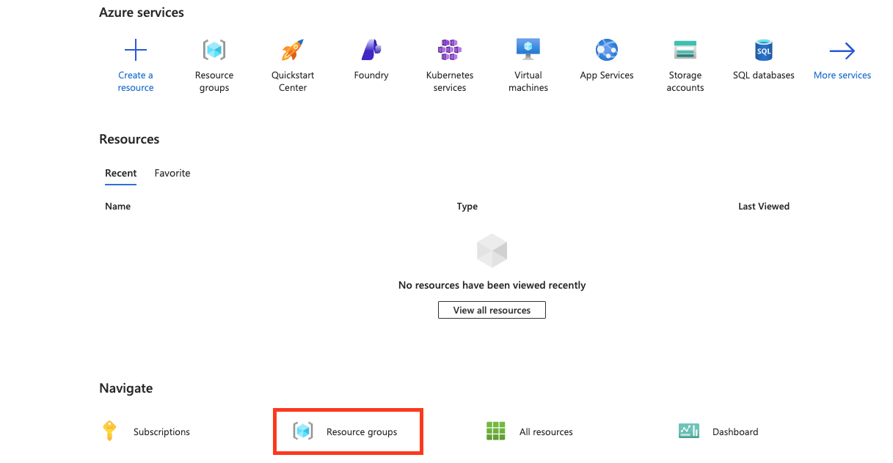

# Task 1: Create Your Connectivity Hub

Welcome! It's time to start your quest to the cloud! First up we must put on our boots and saddle up...Oh wait! This isn't that type of quest, instead you get to login to Azure! Exciting! 

1. Open a web browser and navigate to [portal.azure.com] (https://portal.azure.com)
2. Login using the username and password provided to you by your instructor.
3. If a message pops up asking to tour Azure, you can click Maybe later. (or if you want a side quest, go for it!)

## On this page
- [Virtual Network Planning](#virtual-network-planning)
- [Creating the Hub Network](#creating-the-hub-network)
- [Azure Bastion Setup](#azure-bastion-setup)
- [Subnet Architecture](#subnet-architecture)
- [Subnet Configuration](#subnet-configuration)
- [Network Validation](#network-validation)

## Find Your Resource Group

Do you remember that old phrase “like finding a needle in a haystack”? It alludes to something that is hard to find. Azure has several resources available to you. A resource group is used to logically organize resources such as virtual machines, virtual networks, security appliances etc. Using resource groups makes it easier to organize and find your provisioned resources in Azure. A resource group has been created for you as part of the initial setup for this lab! 

Your Quest Map

   

1. Near the bottom of the screen click on Resource groups.
  
2.  Notice a resource group has been created it should be called hub-studentXX-lab-rg where XX represents your pod number. The screenshots in this lab use pod 2 so your screen will look different. If you're wondering, we call this the 'hub' as it can be seen as a connectivity or security hub for traffic in and out of Azure. 
3. Click into the resource group.

    

4. You might be thinking "this isn't very impressive" and you'd be right, we need to start filling our resource group with...resources. First up we will create our virtual network.

    ## Virtual Network Planning

    In this section, we'll create the network foundation for your connectivity hub, including the virtual network, Azure Bastion, and all required subnets.

     How are we going to network this stuff?

    

    In the physical world, we have cables and switches to connect everything together! But how do we build network connectivity in Azure? We use the concept of a virtual network and subnets to build a network between our virtual machines and appliances.

    ## Creating the Hub Network
    Your Quest Map
     

5. Click Create.

    

6. You will be taken to the Marketplace.

7. In the search field type virtual network and hit enter.

8. Click on the Virtual Network box.

    
    
9. Ensure you have the correct subscription and then click Create.

    

10. Type `vnet-hub-azlab` in the Virtual Network name textbox.

11. Ensure Region is set to US East. (We are using the US due to the Azure subscription we are using for this lab environment)

12. Click Next.

    
    
    ## Azure Bastion Setup

    We are now going to create an Azure Bastion which is a **paid** service that provides secure RDP/SSH connectivity to your virtual machines over TLS. Azure Bastion allows you to RDP/SSH into your various virtual machines without having to assign a public IP to every virtual machine (Psst! Public IP addresses cost money in Azure!). Using a Bastion helps keep your costs lower as you only need one public IP address instead of one for each virtual machine you want to access!
    
    Your Quest Map

     

13. Click Enable Bastion checkbox.

14. Rename it to `bastion-hub-azlab`.

15. Click on the blue Create a public IP address.

    
    
16. Change the Name to `pip-bas-hub-azlab` then click OK. 

    

17. Click the Next button on the bottom of the screen.

18. Change the IP address to 10.2.0.0 /16 as shown below. If you see an error about malformed IP address, make sure there is no space after the IP address. You may see a message about the address prefix overlapping with another virtual network. You can ignore this message as we will not be networking with this other virtual network.

    

19. Click Review + Create.
    
    

20. Double-check the information presented matches what we’ve intended to configure so far and then click the blue create button.

21. After 10-15 minutes your screen will look similar to the screenshot below. (This might be a good time to grab a coffee or tea!)

22. Click Go to resource.

    

## Create Subnet Architecture
The next step is to prepare the necessary subnets to enable connectivity to the FortiGate-VMs. Four subnets are needed, one for the public or untrusted zone, the private or trusted zone, out-of-band management, and the dedicated subnet for session and cluster syncing. Finally, we will create a subnet called Protected A, this is where we could deploy things like FortiAnalyzer or other apps. (more on this later)

## Subnet Configuration

Your Quest Map

1.  On the left-hand side, expand the Settings menu

2.  Click on Subnets.

     
    
3.  Notice the subnets we created earlier are listed here. Let's create five new subnets.

4.  Click on the Subnet button (see screenshot above).

5.  Change the name to `Public`.

6.  Ensure the starting address is 10.2.2.0 and the Size is /24 then click Add.

    

7.  Please repeat the process of creating the remaining four subnets as per the table below:

    | Subnet Name      | Starting Address | Size |
    |------------------|------------------|------|
    | Private          | 10.2.3.0         | /24  |
    | Management       | 10.2.4.0         | /24  |
    | HA_Intra-Cluster | 10.2.5.0         | /24  |
    | ProtectedA       | 10.2.6.0         | /24  |

## Network Validation

1. Please confirm your results look like the screenshot below.

     

---

**Next Step:** [FortiGate Deployment](02-task2-fortigate-ha.md) to add security and high availability to your network.
