# Task 1: Create Your Connectivity Hub

## On this page
- [Virtual Network Planning](#virtual-network-planning)
- [Creating the Hub Network](#creating-the-hub-network)
- [Azure Bastion Setup](#azure-bastion-setup)
- [Subnet Architecture](#subnet-architecture)
- [Subnet Configuration](#subnet-configuration)
- [Network Validation](#network-validation)

Do you remember that old phrase “like finding a needle in a haystack”? It alludes to something that is hard to find. Azure has several resources available to you. A resource group is used to logically organize resources such as virtual machines, virtual networks, security appliances etc. Using a resource group makes it easier to organize and find your provisioned resources in Azure. We are going to start by creating a resource group for our connectivity hub that manages all ingress and egress traffic into our deployment.  

Your Quest Map

   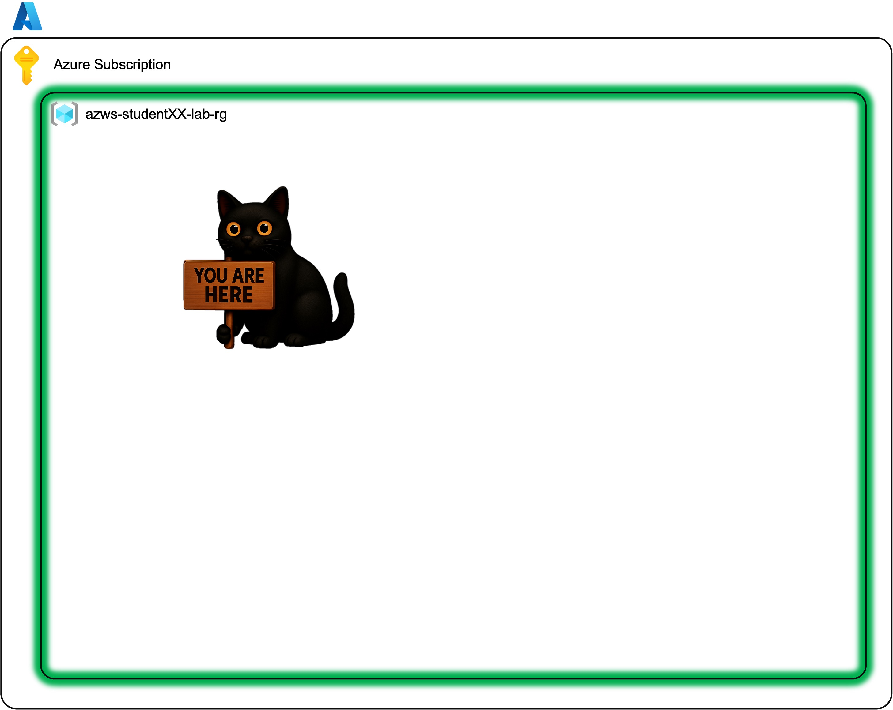

## Steps to Create Resource Group

1. In the Azure subscription you have decided to use, click on Resource Group under Azure services. 

    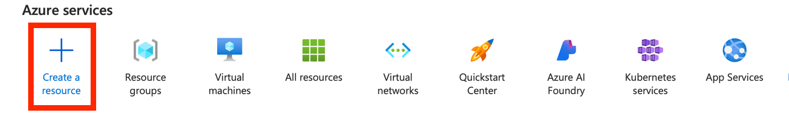
   
    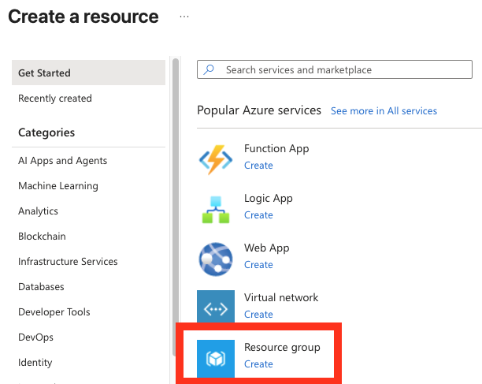

3. Click Create.

    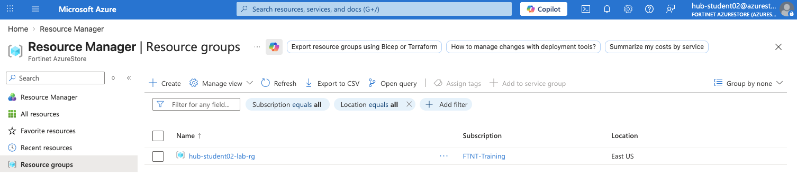

4. Choose your appropriate subscription.

    !!! note 
         Your subscription may look different from the screenshots in this lab guide. 

5. Enter `rg-hub-azlab` in the Resource Group name.

6. Under region select Canada Central.

    !!! note "Did you know?"
        A region in Azure is defined as a collection of Azure data centers connected by a high-capacity, low-latency network, all within a specific geography, to provide local access to cloud services.

    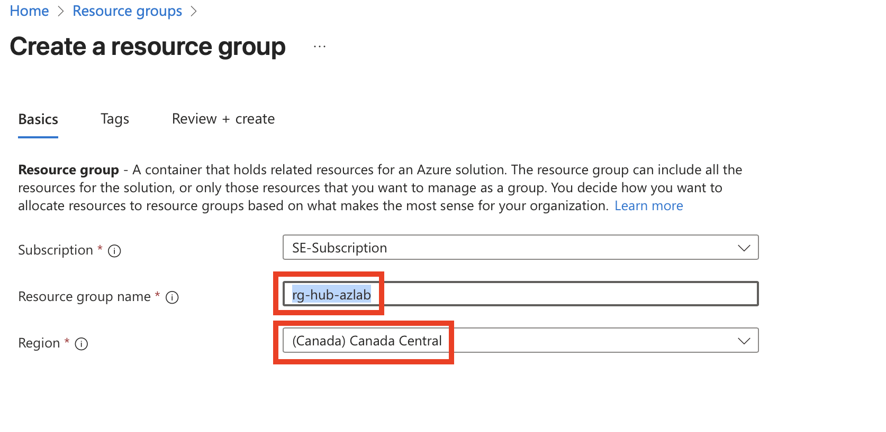

7. Click Review + create at the bottom of the screen.

    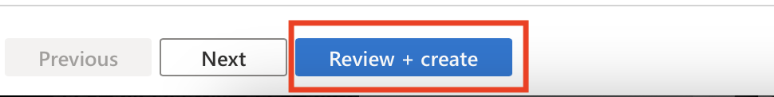

8. At the bottom of the screen click the blue Create button.

9. A window will pop up in the right-hand corner, saying Resource group created. Click on the Go to resource group button. 
     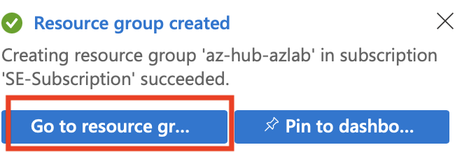

10. Now that we have created a resource group, we can start adding resources to it. The first thing we are going to create is the virtual network.

    In this section, we'll create the network foundation for your connectivity hub, including the virtual network, Azure Bastion, and all required subnets.

    ## Virtual Network Planning

     How are we going to network this stuff?

    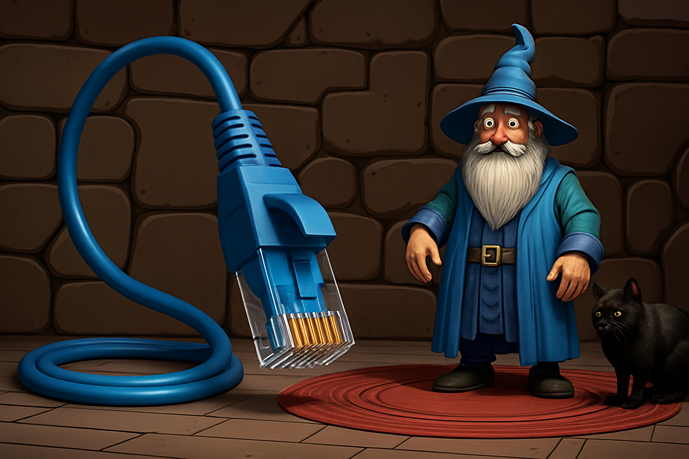

    In the physical world, we have cables and switches to connect everything together! But how do we build network connectivity in Azure? We use the concept of a virtual network and subnets to build a network between our virtual machines and appliances.

    ## Creating the Hub Network
    Your Quest Map
     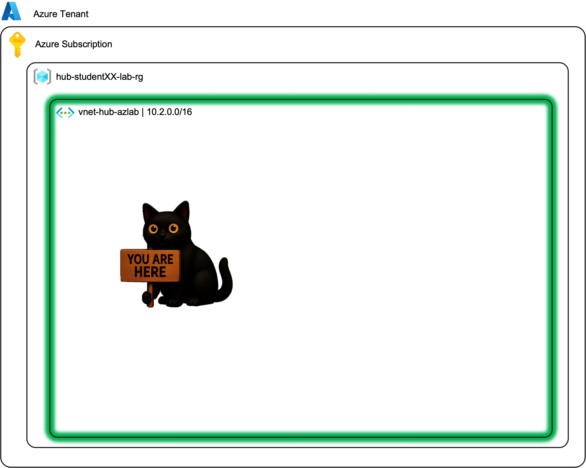

11. Click Create.

    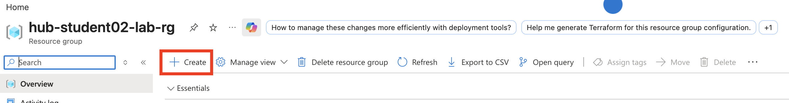

12. You will be taken to the Marketplace.

13. In the search field type virtual network and hit enter.

14. Click on the Virtual Network box.

    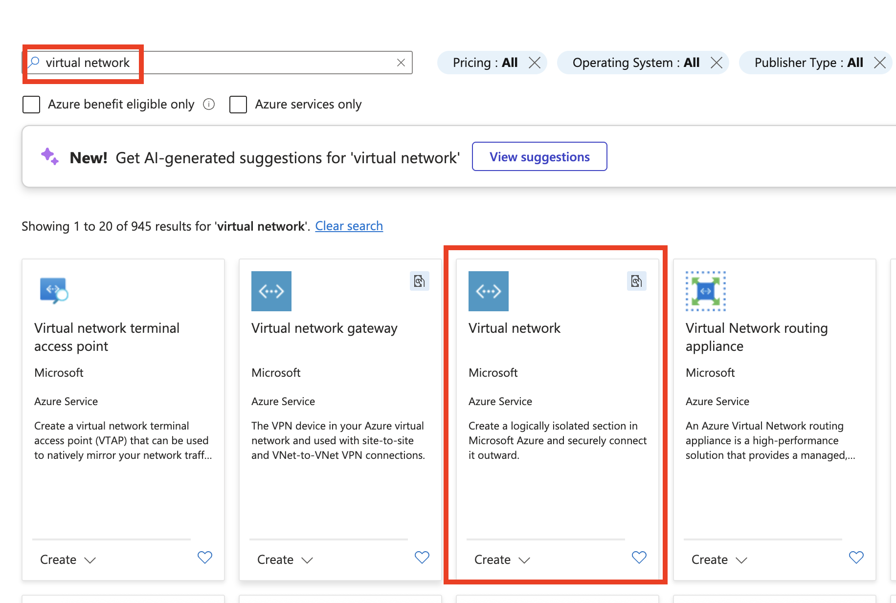
    
15. Ensure you have the correct subscription and then click Create.

    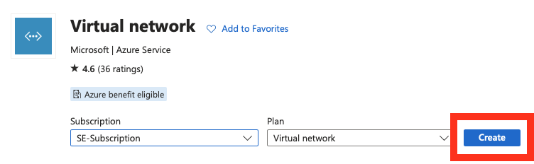

16. Type `vnet-hub-azlab` in the Virtual Network name textbox.

17. Ensure Region is set to Canada Central.

18. Click Next.

    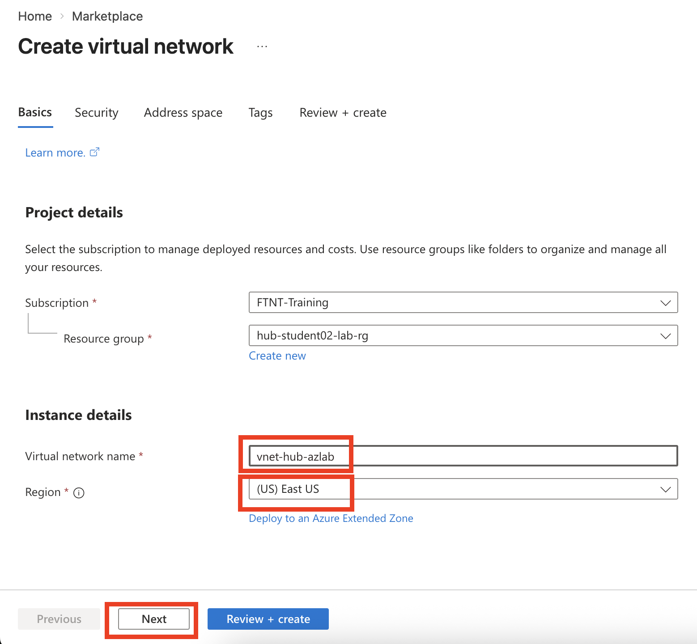
    
    ## Azure Bastion Setup

    We are now going to create an Azure Bastion which is a **paid** service that provides secure RDP/SSH connectivity to your virtual machines over TLS. Azure Bastion allows you to RDP/SSH into your various virtual machines without having to assign a public IP to every virtual machine (Psst! Public IP addresses cost money in Azure!). Using a Bastion helps keep your costs lower as you only need one public IP address instead of one for each virtual maching you want to access!
    
    Your Quest Map

     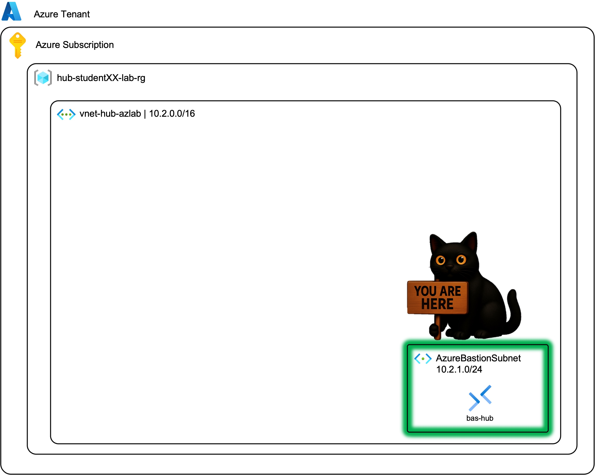

20. Click Enable Bastion checkbox.

21. Rename it to `bastion-hub-azlab`.

22. Click on the blue Create a public IP address.

    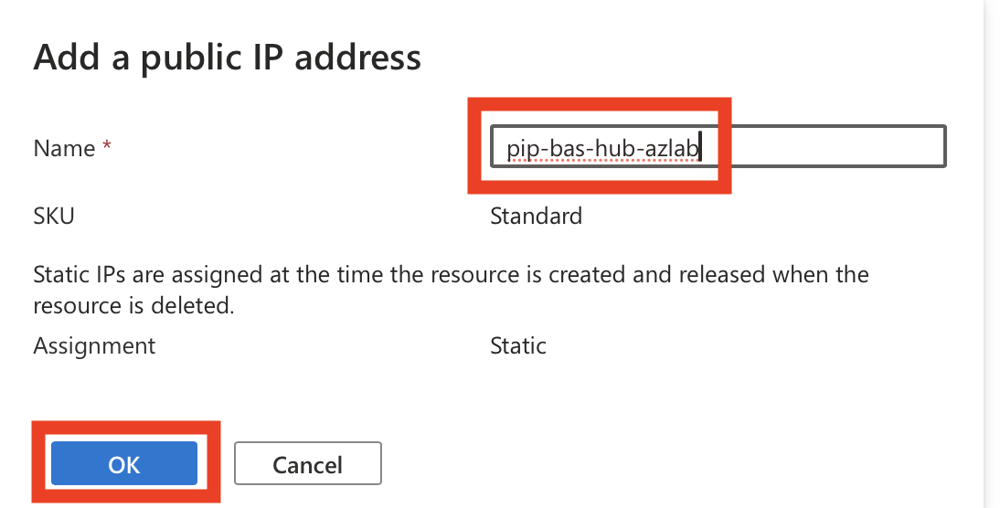
    
23. Change the Name to `pip-bas-hub-azlab` then click OK.

    !!! note 
    You may see a message about the address prefix overlapping with another virtual network. You can ignore this message as we will not be networking with this other virtual network.

    

25. Click the Next button on the bottom of the screen.

26. Change the IP address to 10.2.0.0 /16 as shown below.

    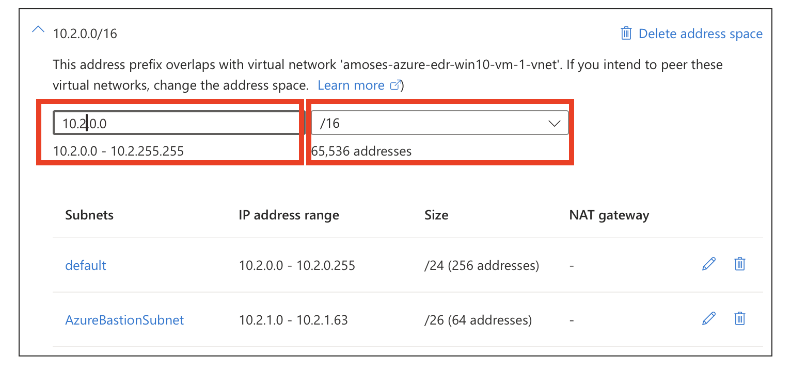

27. Click Review + Create.
    
    

28. Double-check the information presented matches what we’ve intended to configure so far and then click the blue create button.

29. After 10-15 minutes your screen will look similar to the screenshot below. (This might be a good time to grab a coffee or tea!)

30. Click Go to resource.

    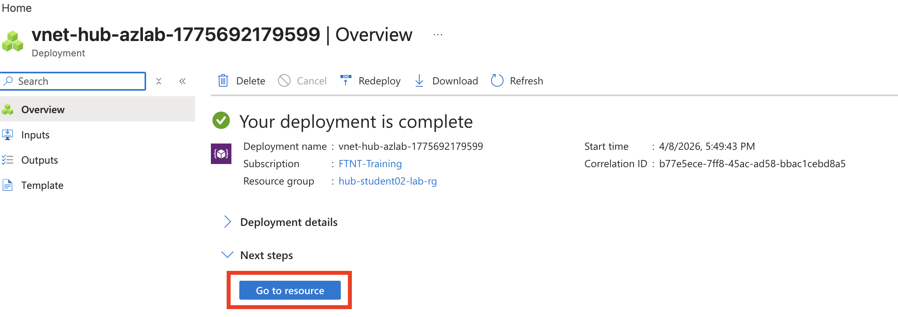

## Create Subnet Architecture
The next step is to prepare the necessary subnets to enable connectivity to the FortiGate-VMs. Four subnets are needed, one for the public or untrusted zone, the private or trusted zone, out-of-band management, and the dedicated subnet for session and cluster syncing. Finally, we will create a subnet called Protected A, this is where we could deploy things like FortiAnalyzer or other apps. (more on this later)

## Subnet Configuration

Your Quest Map

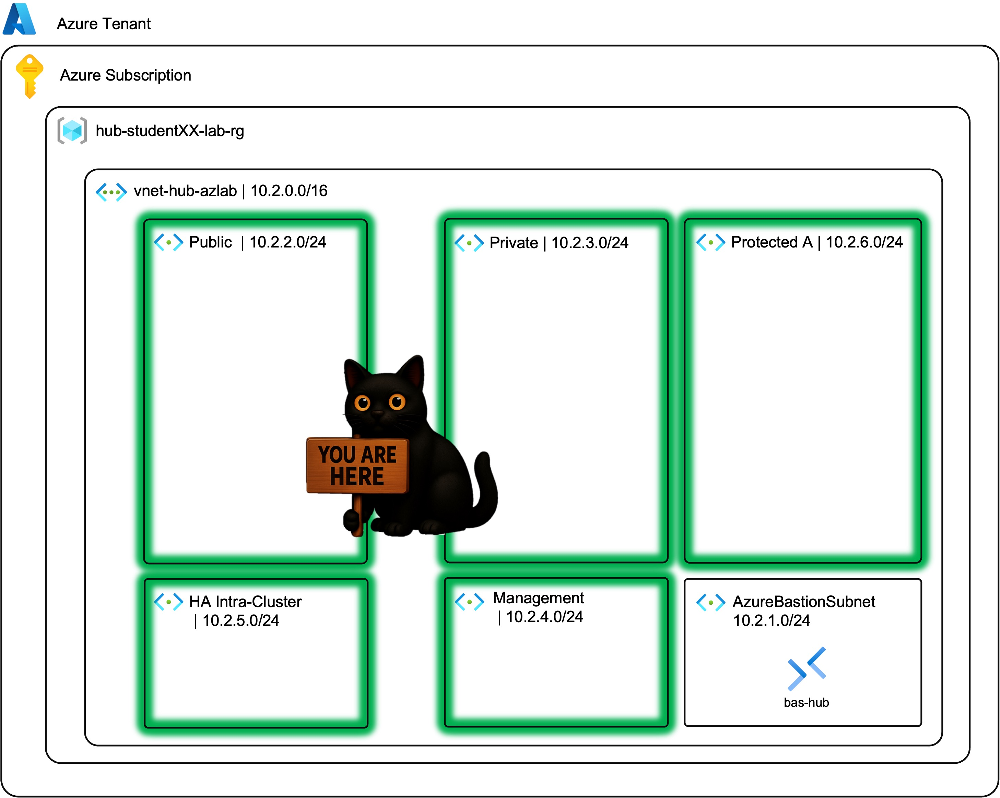

1.  On the left-hand side, expand the Settings menu

2.  Click on Subnets.

     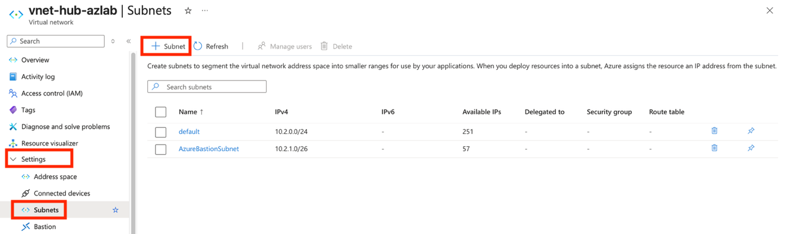
    
3.  Notice the subnets we created earlier are listed here. Let's create four new subnets.

4.  Click on the Subnet button (see screenshot above).

5.  Change the name to `Public`.

6.  Ensure the starting address is 10.2.2.0 and the Size is /24 the click Add.

    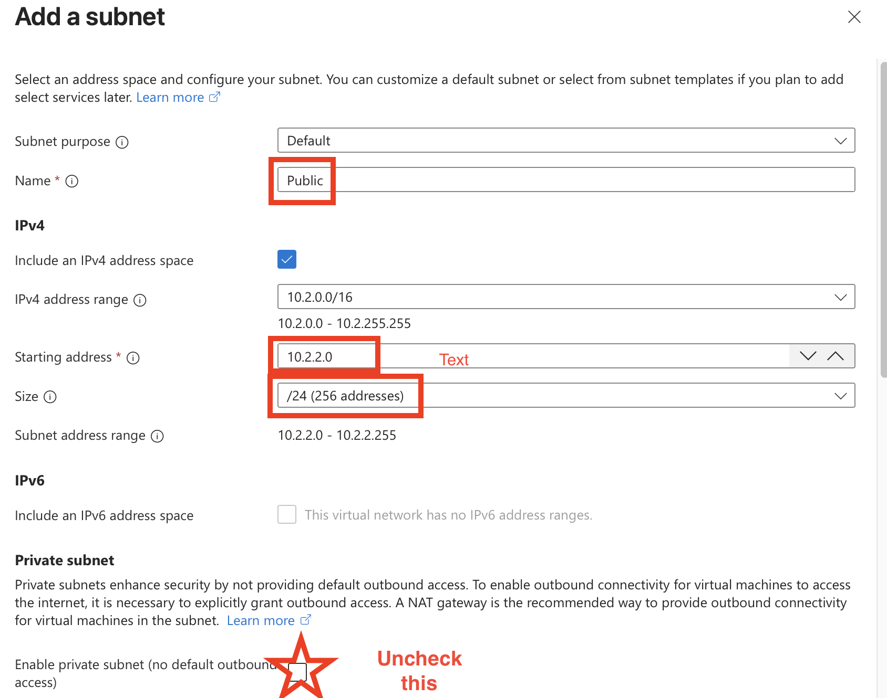

7.  Please repeat the process of creating the remaining four subnets as per the table below:

    | Subnet Name      | Starting Address | Size |
    |------------------|------------------|------|
    | Private          | 10.2.3.0         | /24  |
    | Management       | 10.2.4.0         | /24  |
    | HA_Intra-Cluster | 10.2.5.0         | /24  |
    | ProtectedA       | 10.2.6.0         | /24  |

## Network Validation

1. Please confirm your results look like the screenshot below.

     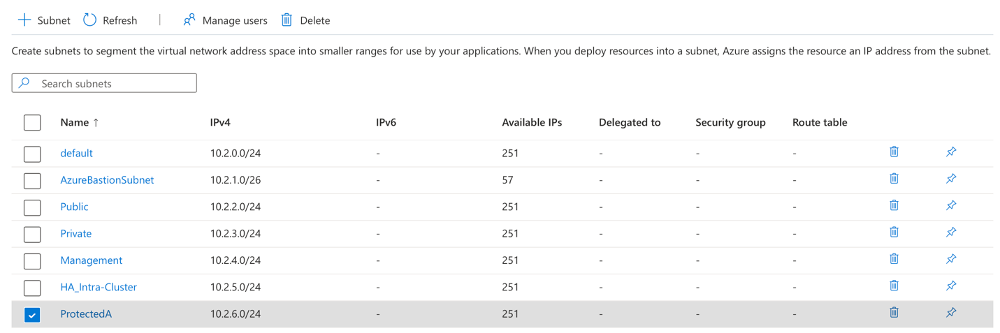

---

**Next Step:** [FortiGate Deployment](02-task2-fortigate-ha.md) to add security and high availability to your network.
