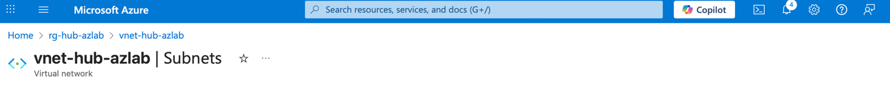
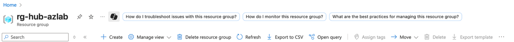
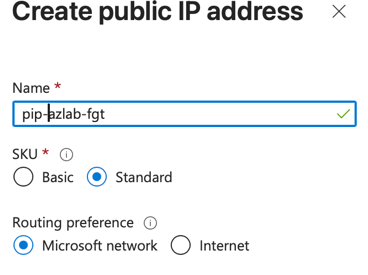
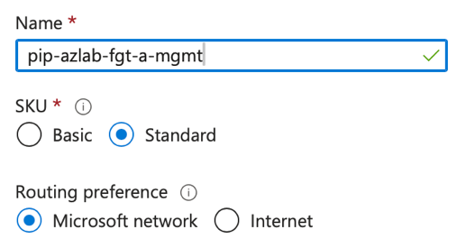
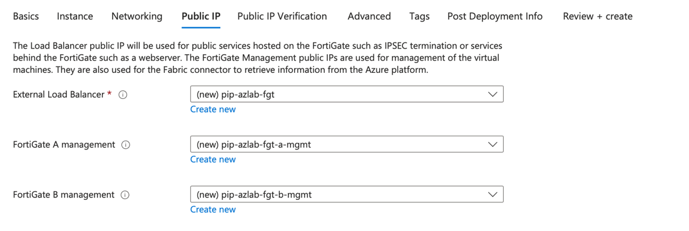

# FortiGate Deployment

In this section, we'll deploy FortiGate firewalls in a high-availability configuration with load balancers to provide robust security for your connectivity hub. You may have heard of the name Load Balancer (LB) sandwich - we are deploying the firewalls between two LB instances to ensure symetric flows of traffic between services behind and infront of the firewalls.

## On this page
- [High Availability Overview](#high-availability-overview)
- [Understanding Availability Zones](#understanding-availability-zones)
- [Template Deployment](#template-deployment)
- [Configuration Parameters](#configuration-parameters)
- [Load Balancer Setup](#load-balancer-setup)
- [Licensing Configuration](#licensing-configuration)
- [Deployment Verification](#deployment-verification)

## High Availability Overview

We are now ready to deploy the HA FortiGates using a template. For additional information regarding the various templates available and their respective SLAs for failover please see [FortiGate Azure Addministration Guide.](https://docs.fortinet.com/document/fortigate-public-cloud/7.4.0/azure-administration-guide/983245)

## Template Deployment

1.  In the top left corner of the screen click on rg-hub-azlab in the breadcrumb trail.

    > 

2.  Click on Create.

    > 

3.  Enter Fortigate in the search box then click on Fortinet FortiGate Next-Generation Firewall.

    > 

4.  Click on the dropdown for Create for Fortinet FortiGate Next-Generation Firewall (not the option that ends with VM)

5.  Click on Active-Passive HA with ELB/ILB in the drop down menu.

    > 


## Configuration Parameters

6.  Select rg-hub-azlab in the Resource group drop down.

7.  Set region to Central Canada.

8.  Set the FortiGate administrative username to `fortinetuser`

9.  Set the password to `PizzaDay12345!`

10. Type the same password in the Confirm password box: `PizzaDay12345!`

11. Set the FortiGate Name Prefix to azlab

12. Click Next.

    > 


13. Ensure FortiGate Image Version is set to 7.4.8.

14. Ensure Availability Option is set to Availability Zones.

    > 

## Understanding Availability Zones

!!! info "What are availability zones?"
    Wouldn't it be nice if we all had a spare home if something were to happen to one of them? Availability zones help create redundancy and high availability. 
    
    According to learn.microsoft.com, Availability Zones are separated groups of datacenters within a region. Each availability zone has independent power, cooling, and networking infrastructure, so that if one zone experiences an outage, then regional services, capacity, and high availability are supported by the remaining zones.

Need to replicate the diagram below.


> 

## Licensing Configuration

15. Scroll down.

16. Check the 'My organization is using the FortiFlex subscription service' box.

17. You were provided FortFlex tokens you will use those tokens to license these firewalls. **Do not copy the tokens in the screenshot below**.

18. Enter one of the provided tokens for FortiGate A.

19. Enter one of the provided tokens for FortiGate B.

20. Click Next.

    > 


21.  Click Next.

22. We will now map the subnets we created earlier to the FortiGate.

23. Click on the drop down menu beside Virtual network and select vnet-hub-azlab.

24. Click on the dropdown menu beside External subnet and select Public.

25. Click on the dropdown menu beside Internal subnet and select Private

26. Click on the HA Sync subnet dropdown and select HA_Intra-Cluster.

27. Click on the HA Management subnet dropdown and select Management.

28. Notice we are also creating a new subnet called Protected A subnet; leave it a the default setting.

29. If needed, scroll down the Accelerated networking and select disabled

30. Confirm your configuration looks like the screenshot below.

    > 
    >
    > 

## Load Balancer Setup

31. Now we will create public IP addresses for the external load balancer and FortiGate management interfaces.

32. Click create new under the External Load Balancer and edit the name to match the screenshot below.

    > 

33. Click OK at the bottom of the screen.

34. Repeat this process for FortiGate A and B management and match the name in the screen shots below.

    **FortiGate A** and **FortiGate B**:

    > 

    > 

35. When you are finished, ensure your configuration looks like the screenshot below.

    > 

36. Click Next at the bottom of the page until you reach the Review and create page.

37. Allow the final validation to run. This may take up to 30 seconds.

38. Click Create at the bottom of the page.

## Deployment Verification

39. Eventually your screen will refresh show something similar to the one below.

    ```bash
    config system ha
    set group-name "azure-ha-cluster"
    set mode a-p
    set hbdev "port3" 50
    set ha-mgmt-status enable
    ha-direct
    ```

    > 

40. When your deployment is complete it will look similar to the screen shot below. This can take a few minutes to display.

    > 

---

**Next Step:** [Testing & Validation](03-architecture-validation.md) to validate your deployment and test connectivity flows.
