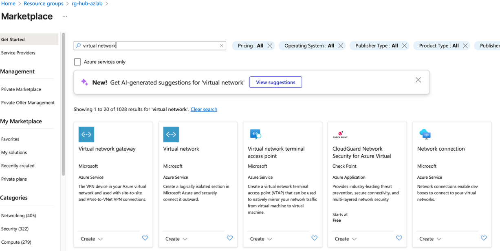
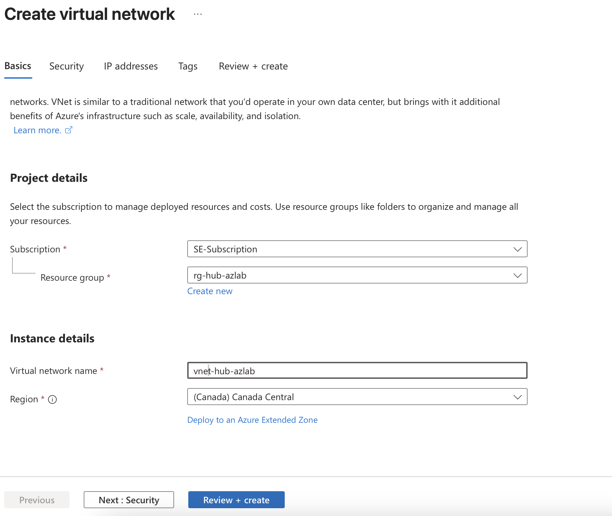
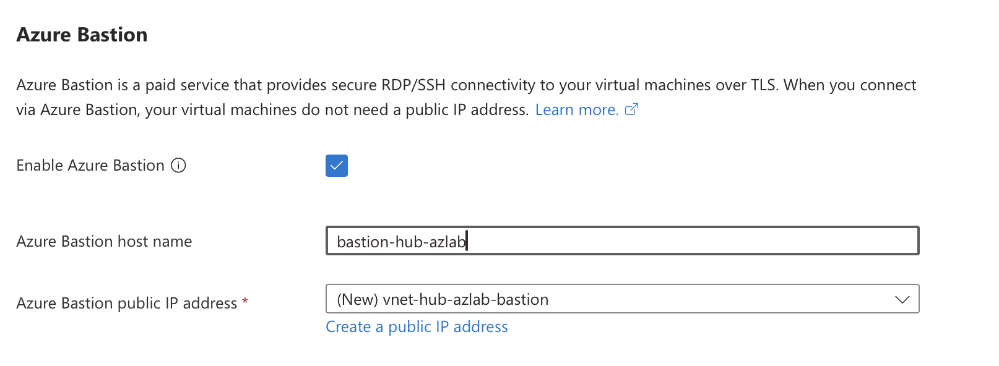
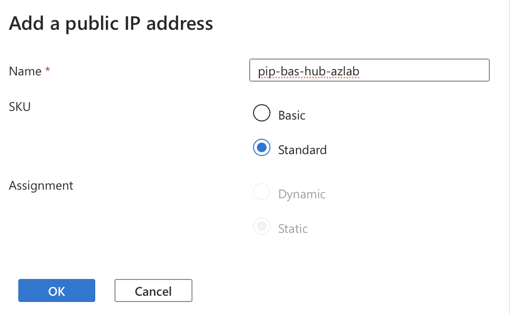
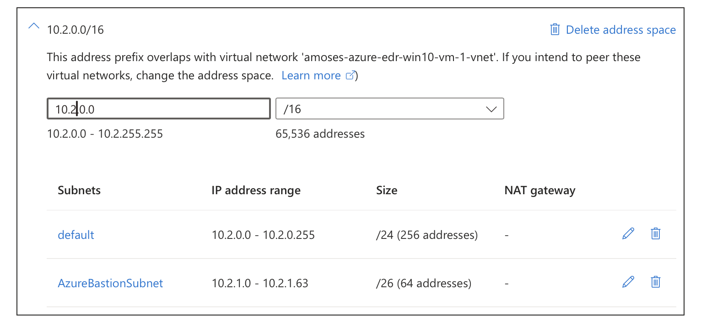
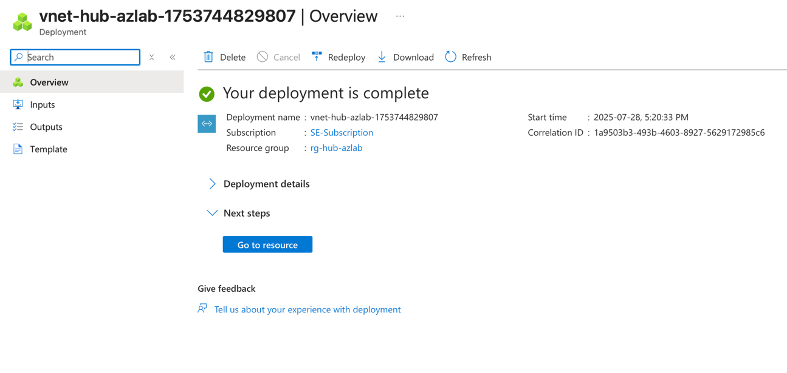
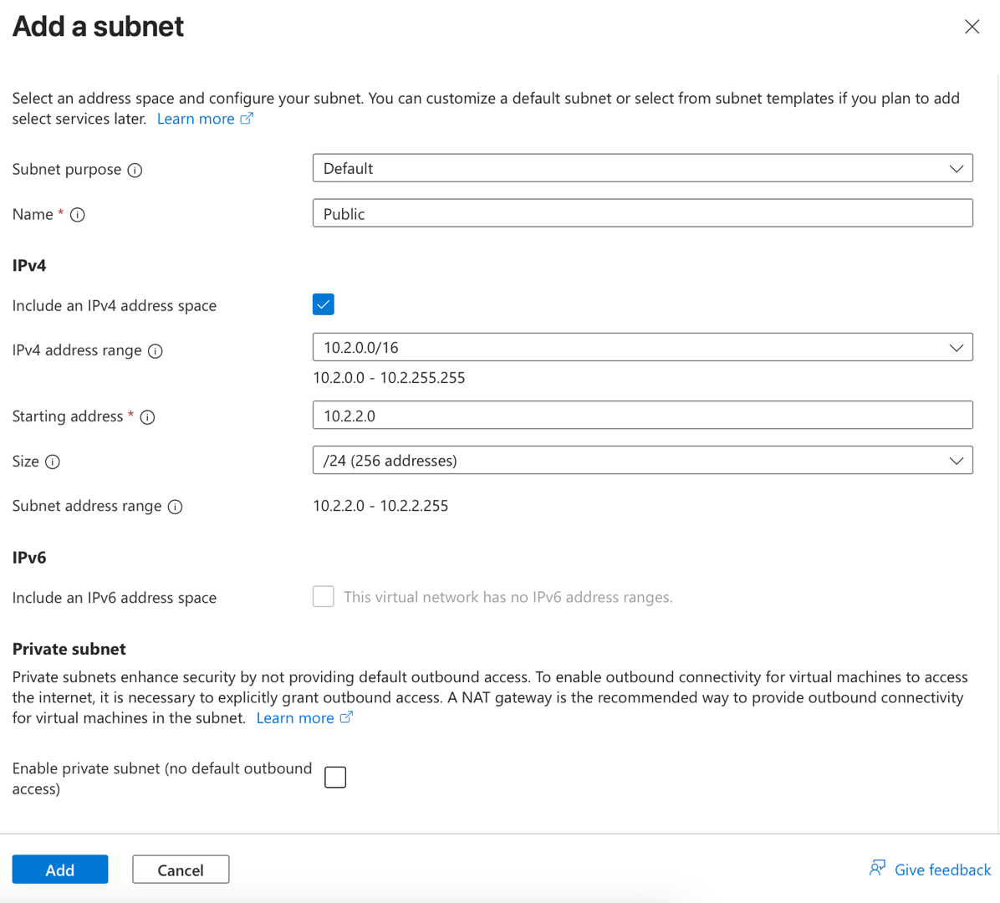

# Building Network Infrastructure

In this section, we'll create the network foundation for your connectivity hub, including the virtual network, Azure Bastion, and all required subnets.

## On this page
- [Virtual Network Planning](#virtual-network-planning)
- [Creating the Hub Network](#creating-the-hub-network)
- [Azure Bastion Setup](#azure-bastion-setup)
- [Subnet Architecture](#subnet-architecture)
- [Subnet Configuration](#subnet-configuration)
- [Network Validation](#network-validation)

## Virtual Network Planning

> How are we going to network this stuff?

In the physical world, we have cables and switches to connect everything together! But how do we build network connectivity in Azure? We use the concept of a virtual network and subnets to build a network between our virtual machines and appliances.

## Creating the Hub Network

10. Click Create.

    > 

11. You will be taken to the Marketplace.

12. In the search field type virtual network and hit enter.

13. Click on the Virtual Network box.

    > 

    Step13

    Step12

14. Click Create.

    > 

15. Type `vnet-hub-azlab` in the Virtual Network name textbox.

16. Ensure Region is set to Canada Central.

17. Click Next Security

    > 

    Step17

    Step16

    Step15

## Azure Bastion Setup

> We are now going to create an Azure Bastion which is a paid service that provides secure RDP/SSH connectivity to your virtual machines over TLS. When you connect via Azure Bastion, your virtual machines do not need a public IP address.

18. Click Enable Bastion.

19. Rename it to `bastion-hub-azlab`.

20. Click on the blue Create a public IP address.

    > 

    Step 20

    Step19

    > 

    > 

    Step18

21. Change the Name to pip-bas-hub-azlab then Click OK.

    > 

22. Click the Next: IP addresses button at the bottom of the screen.

23. Change the IP address to 10.2.0.0 /16 as shown below.

    > 

24. After several minutes your screen will look similar to the screen shot below.

25. Click Go to resource.

    > 

## Subnet Architecture

The next step is to prepare the necessary network to enable connectivity to the FortiGate-VMs. Four interfaces are most commonly used, one for the dedicated public or untrusted zone, the private or trusted zone, out-of-band management, and the dedicated channel for session and cluster syncing (as required).

## Subnet Configuration

1.  On the left-hand side, expand the Settings menu

2.  Click on Subnets.

    Step 4

    > 

    Step 2

    Step 1

3.  Notice the subnets we created earlier are listed here. Let's create four new subnets.

4.  Click on the Subnet button (see screenshot above).

5.  Change the name to Public

6.  Ensure the starting address is 10.2.2.0 and the Size is /24.

    > 

7.  Please repeat the process of creating the remaining three subnets as per the table below:

    | Subnet Name | Starting Address | Size |
    |-------------|------------------|------|
    | Private | 10.2.3.0 | /24 |
    | Management | 10.2.4.0 | /24 |
    | HA_Intra-Cluster | 10.2.5.0 | /24 |
    | ProtectedA | 10.2.6.0 | /24 |

## Network Validation

8.  Please confirm your results look like the screenshot below.

    > 

---

**Next Step:** [Deploying FortiGate High Availability Cluster](03-fortigate-ha.md) to add security and high availability to your network.