# Task 2: FortiGate Deployment
One way of deploying FortiGates in Azure is to use the predefined templates in Market Place. A template decides how many FortiGates to deploy, how to design networking, and how to conduct High Avaiability. Let's look at the four templates available for deployment.

The four available templates are:
- Single FortiGate VM
- Active-passive HA with SDN connector failover
- Active-active with external and internal Azure Load Balancer
- Active-passive with external and internal Azure load balancer

### Single FortiGate VM 

This is the simplest building block, a single FortiGate VM is used and provides no HA at the FortiGate level. This single FortiGate-VM processes all the traffic and becomes a single point of failure during operations and upgrades. You can also use this block in an architecture with multiple regions where a FortiGate is deployed in each region. This setup provides an SLA of 99.9% when using a premium SSD disk.
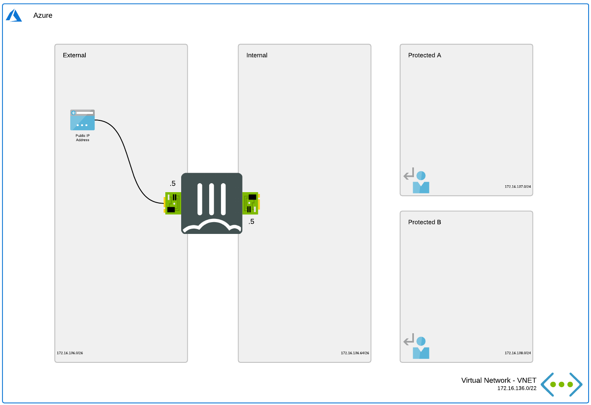

### Active-passive HA with SDN connector failover

Active-passive HA with SDN connector failover: This design deploys two FortiGate-VMs in active-passive mode connected using the unicast FortiGate clustering protocol FGCP HA protocol. This protocol synchronizes the configuration. On failover, the passive FortiGate takes control and issues API calls to Azure to shift the public IP address and update the internal user-defined routing to itself. Shifting the public IP address and gateway IP addresses of the routes takes time for Azure to complete. 

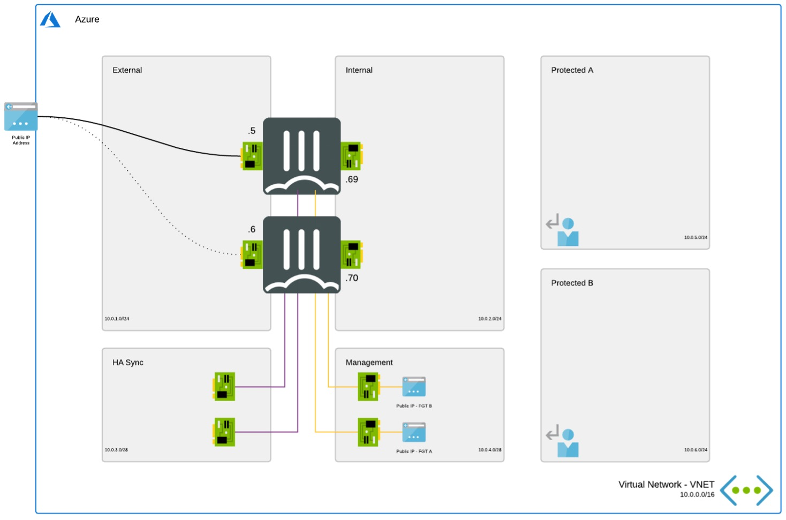

### Active-active with external and internal Azure Load Balancer (LB)

This design deploys two FortiGate-VMs in active-active as two independent systems. In this setup, the Azure LB handles traffic failover using a health probe towards the FortiGate-VMs. You configure the public IP addresses on the Azure LB. The public IP addresses provide ingress and egress flows with inspection from the FortiGate. You can use a FortiManager or local replication to synchronize configuration in this setup.

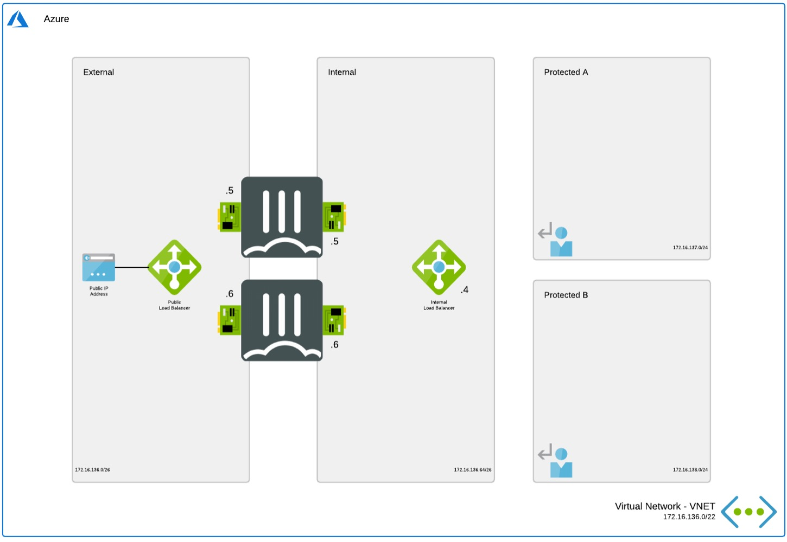

### Active-passive with external and internal Azure load balancer (LB)

This design deploys two FortiGate-VMs in active-passive mode connected using unicast FortiGate clustering protocol (FGCP) HA protocol. In this setup, the Azure LB handles traffic failover using a health probe towards the FortiGate-VMs. The failover times are based on the health probe of the Azure LB: 2 failed attempts per 5 seconds with a maximum of 15 seconds. You configure the public IP addresses on the Azure LB. The public IP addresses provide ingress and egress flows with inspection from the FortiGate. This is what we deploy in our lab!

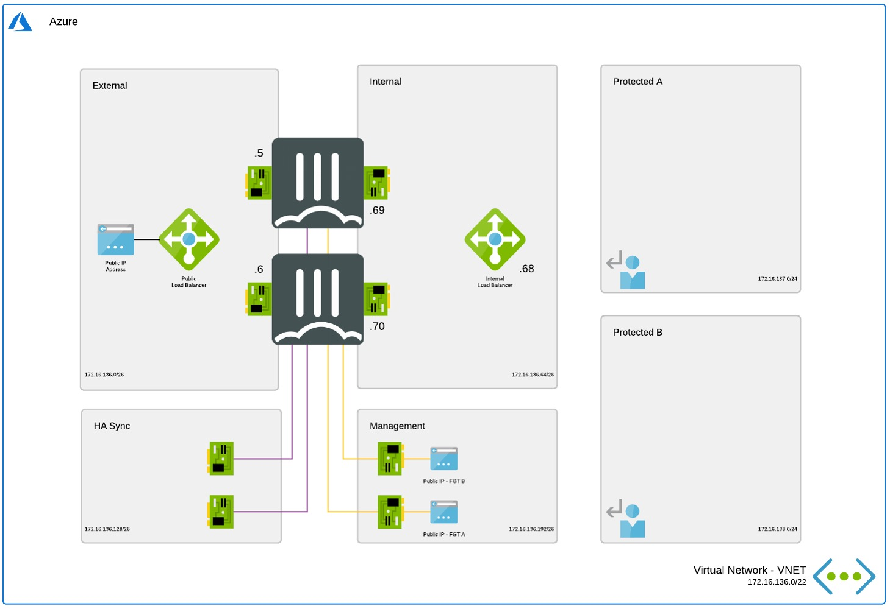

## Introduction 

In this section, we'll deploy FortiGate firewalls in a high-availability configuration with load balancers to provide robust security for your connectivity hub. You may have heard of the name "load balancer sandwich" - we are deploying the firewalls between two LB instances to ensure symmetric flows of traffic between services behind and infront of the firewalls.

## On this page
- [High Availability Overview](#high-availability-overview)
- [Template Deployment](#template-deployment)
- [Configuration Parameters](#configuration-parameters)
- [Licensing Configuration](#licensing-configuration)
- [Load Balancer Setup](#load-balancer-setup)
- [Deployment Verification](#deployment-verification)

## High Availability Overview

We are now ready to deploy the HA FortiGate-VMs from Azure Marketplace. We are going to deploy two FortiGate-VMs running in Active-Passive mode. We will also deploy two load balancers to load balance traffic from both internal and external sources! Does that sound like too much? Don't worry, Azure MarketPlace has a preconfigured template to take care of all that! Ready? Let’s go!

For additional information regarding the various templates available and their respective SLAs for failover please see [FortiGate Azure Addministration Guide.](https://docs.fortinet.com/document/fortigate-public-cloud/7.4.0/azure-administration-guide/983245)

## Template Deployment

Your Quest Map

 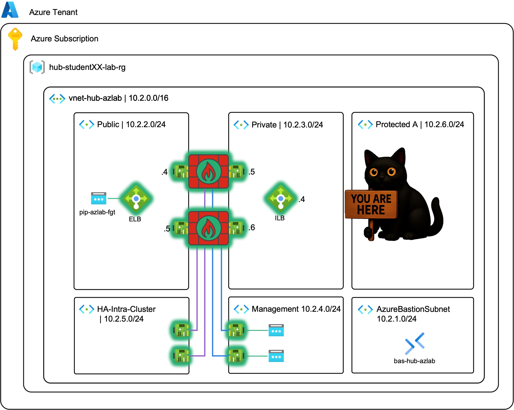  

1. In the top search box enter the name of your resource group and click into it. You resource group was named hub-studentXX-lab-rg where XX is your pod number.

    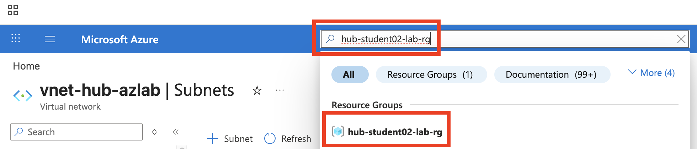

2. Click on Create.

    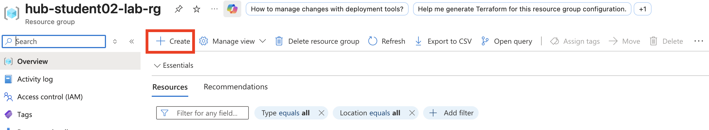

3. Enter FortiGate in the search box then click on Fortinet FortiGate Next-Generation Firewall.

    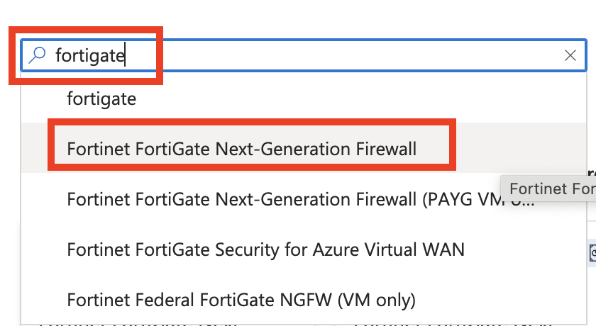

4. Click on the dropdown for Create for Fortinet FortiGate Next-Generation Firewall (not the PAYG option).

5. Click on Active-Passive HA with ELB/ILB in the drop-down menu.

    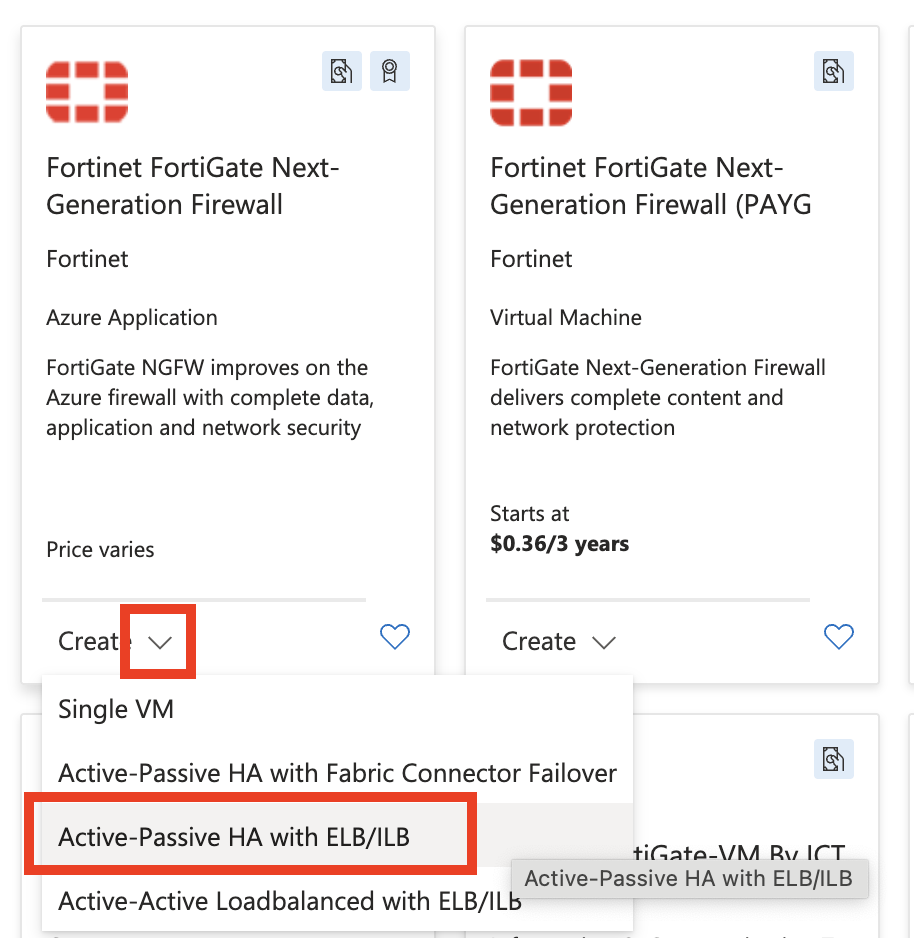

    !!! note annotate "Note"
        ELB stands for external load balancer and ILB stands for internal load balancer. 

    ## Configuration Parameters

6. Select 'hub-studentXX-lab-rg' in the Resource group drop down.

7. Set region to US East.

8. Set the FortiGate administrative username to `fortinetuser`

9. Set the password to `PizzaDay12345!`

10. Type the same password in the Confirm password box: `PizzaDay12345!`

11. Set the FortiGate Name Prefix to azlab

12. Click Next.

     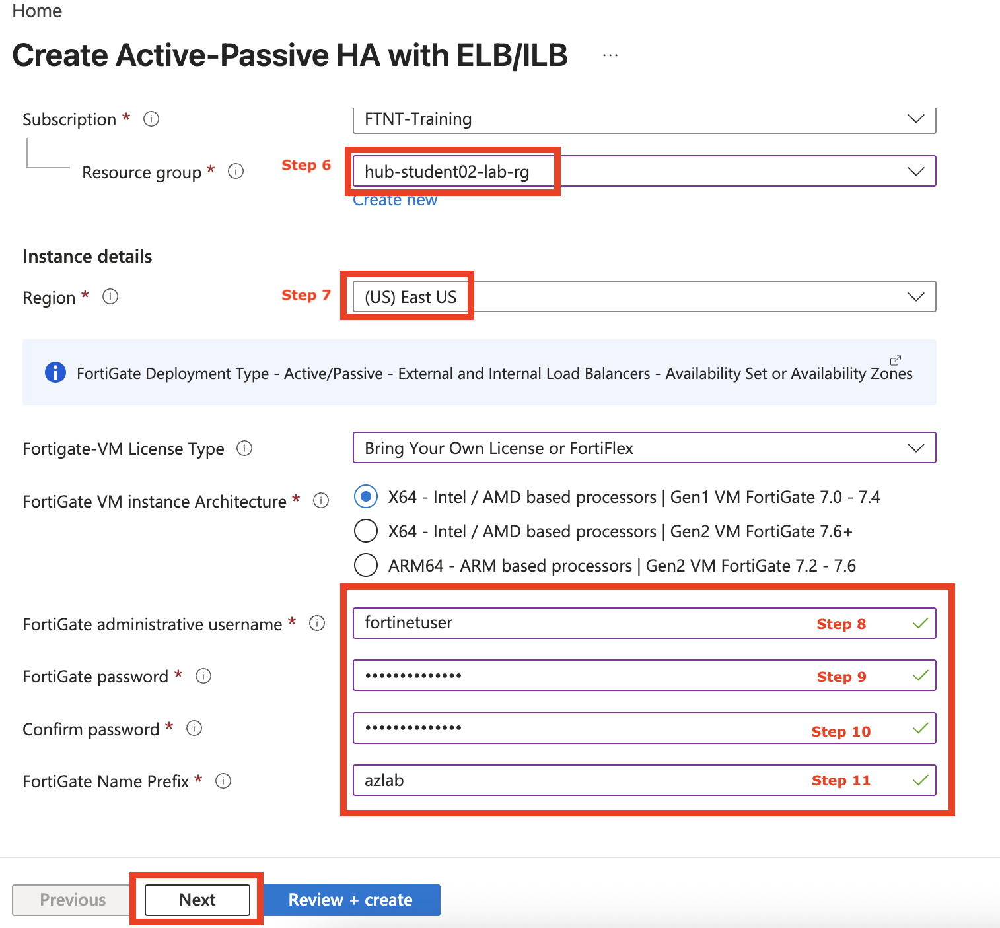
    
13. Ensure FortiGate Image is set to 7.4.11. FortiGate image versions in these drop downs may change over time. If 7.4.11 is not availabe choose the latest version of 7.4.x.
    
  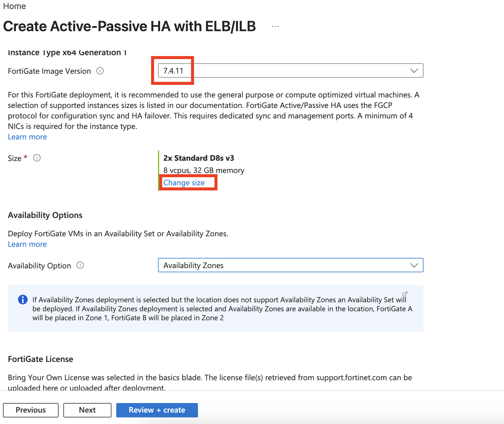 
  
14. Click on the Change Size link in the Size section. Since we are running in a lab environment we do not need a 8vCPU VM. We are going to use an 4 vCPU size instead.
  
15. Look for the Previous Generations drop down and expand it.
    
17. Click on F4.
    
18. Click on Select.
    
  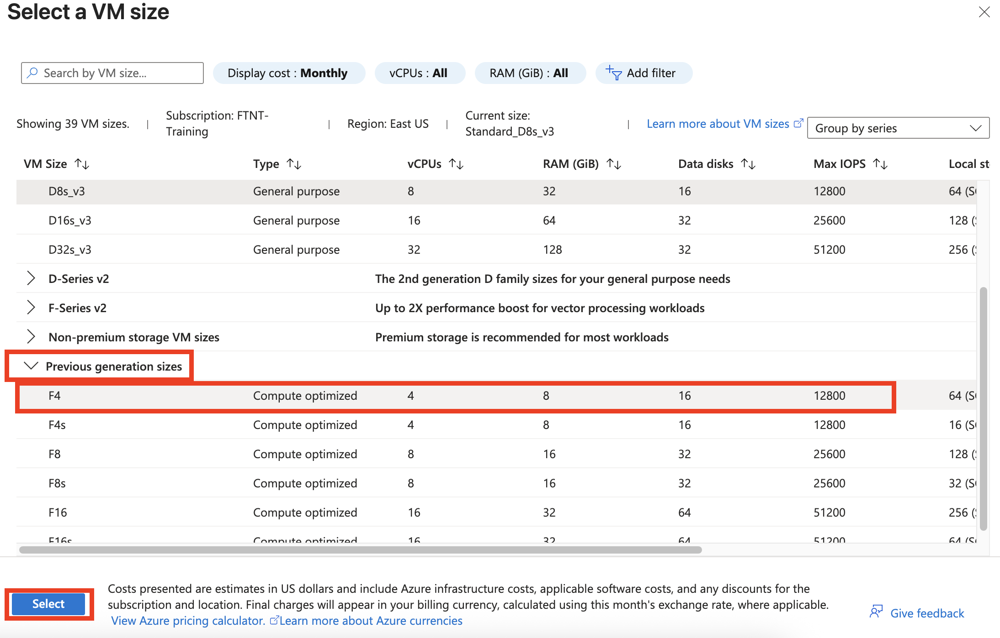 

18. Ensure Availability Option is set to Availability Zones.

## What are availability zones?

 

Wouldn’t it be nice if we all had a spare home? If something were to happen to one of them, we just move over to the other one! This analogy loosely explains availability zones as they help create redundancy and high availability. Take a look at the Azure Region Map below: 

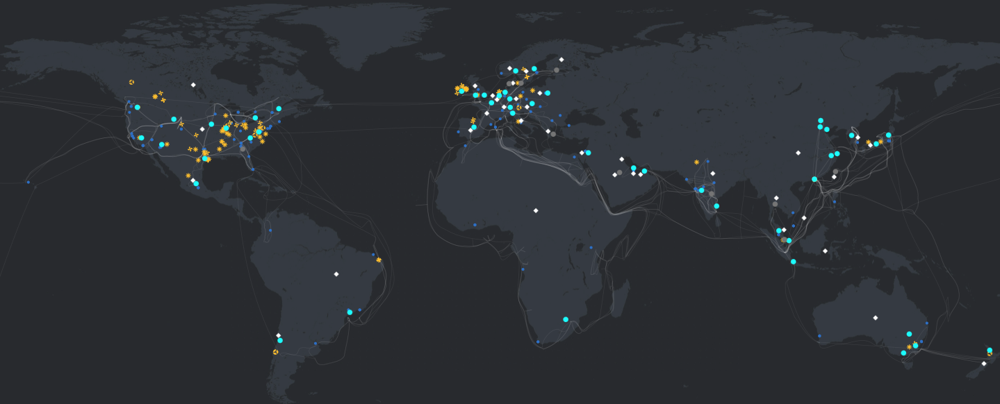 
   
Do you see that Azure has data centers all over the world? Neat eh!? Azure groups data centers into regions. For example, Canada has two Regions: Canada Central and Canada East. Many Azure regions provide availability zones. According to learn.microsoft.com Availability Zones are separated groups of datacenters within a region. Each availability zone has independent power, cooling, and networking infrastructure, so that if one zone experiences an outage, then regional services, capacity, and high availability are supported by the remaining zones.

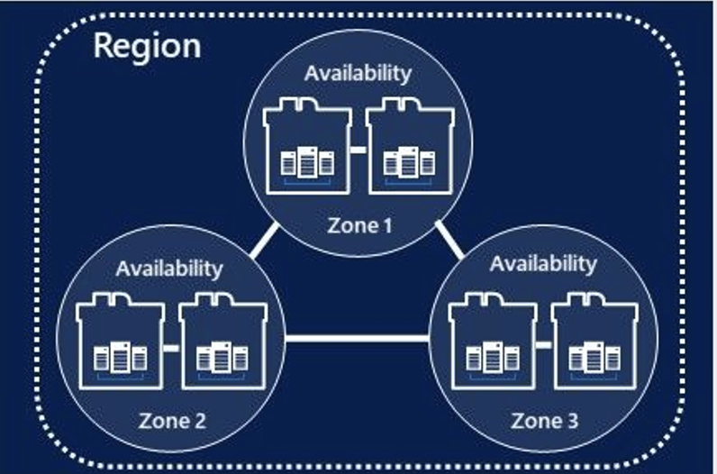

To apply these concepts to our environment, look at the diagram below, see how there is Availability Zone 1 and 2 in dashed blue boxes? Those FortiGates are deployed in two different data centers! If one data center goes down, we can fail over to the other and have our passive FortiGate take over. 

Are availability zones the only form of High availability? No, there is also something called an Avaiability Set. An availability set is deploying HA within a single date center. You can find more information here: https://learn.microsoft.com/en-us/azure/virtual-machines/availability-set-overview.

 Microsoft offers different SLAs on Azure based on the deployment that you use:
- Availability zone (AZ) (different datacenter in the same region): 99.99%
- Availability set (different rack and power): 99.95%
- Single VM with premium SSD: 99.9% (no HA)
  
## Licensing Configuration

16. Scroll down.

17. Check the 'My organization is using the FortiFlex subscription service' box.

18. You were provided FortFlex tokens, you will use those tokens to license these firewalls. **Do not copy the tokens in the screenshot below**.

19. Enter one of the provided tokens for FortiGate A.

20. Enter one of the provided tokens for FortiGate B.

     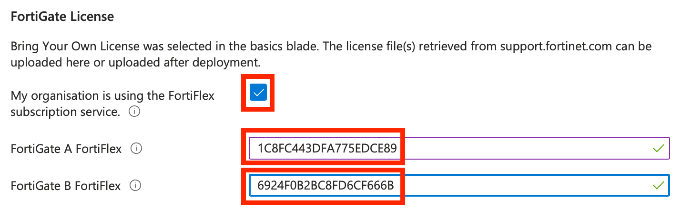

21. Click Next.

22. We will now map the subnets we created earlier to the FortiGate.

23. Click on the dropdown menu beside Virtual network and select vnet-hub-azlab.

24. Click on the dropdown menu beside External subnet and select Public.

25. Click on the dropdown menu beside Internal subnet and select Private

26. Click on the HA Sync subnet dropdown and select HA_Intra-Cluster.

27. Click on the HA Management subnet dropdown and select Management.

28. Notice we are also creating a new subnet called Protected A subnet. Leave this dropdown as it is with the pre-selected Protected A subnet. 

29. If needed, scroll down to Accelerated networking and select disabled.

    !!! Note "Azure Accelerated Networking"
        Azure Accelerated Networking uses hardware-based virtualization to directly link a VM's network interface (NIC) to its network, bypassing the host's virtual switch and improving performance. We don’t need this in our lab. In a production enviroment you can turn on accellerated network to tell Azure to deploy the SR-IOV NIC driver rather than the standard driver, giving better performance.

30. Confirm your configuration looks like the screenshot below.

     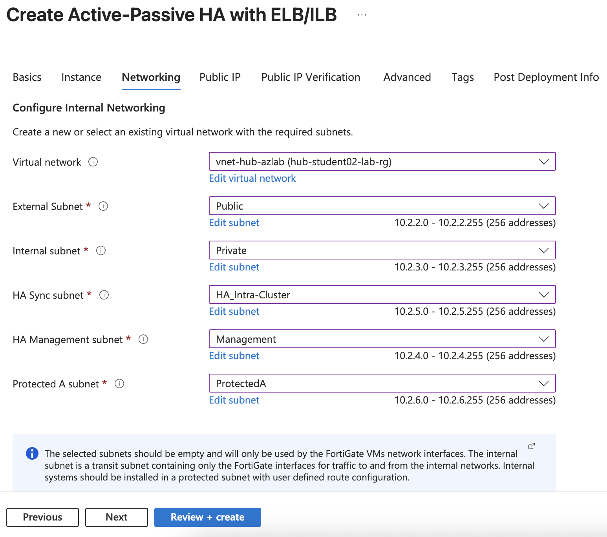
    
     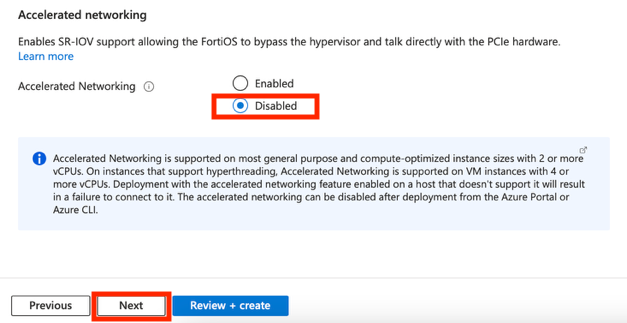

    ## Load Balancer Setup

    ??? info "Why Public IPs for FortiGate Management Instead of Bastion?"
        Great question! In Task 1 we deployed Azure Bastion and talked about how it lets you access VMs without assigning them public IPs — so why are we giving each FortiGate its own management public IP?

        **Bastion is designed for RDP/SSH access to standard VMs.** It works by proxying a remote desktop or terminal session through the Azure portal. FortiGate management, on the other hand, is accessed through its own HTTPS web GUI and CLI (SSH), which have unique session handling, certificate management, and API endpoints that don't play nicely with the Bastion proxy. You need a direct HTTPS connection to the FortiGate's management interface for reliable day-to-day administration.

        **In a production environment** you would typically lock down these management PIPs with Network Security Groups (NSGs) that restrict access to a set of known administrator source IPs, or you might use a VPN/ExpressRoute for private management access and skip the public IPs entirely. For our lab, assigning public IPs to the management interfaces is the simplest way to get you hands-on with the FortiGate GUI quickly.

        **The Bastion we deployed is still valuable!** We'll use it later to access our test VMs in the spoke networks — that's exactly the use case it was built for.

31. Now we will create public IP addresses for the external load balancer and FortiGate management interfaces. (

    Your Quest Map
    
    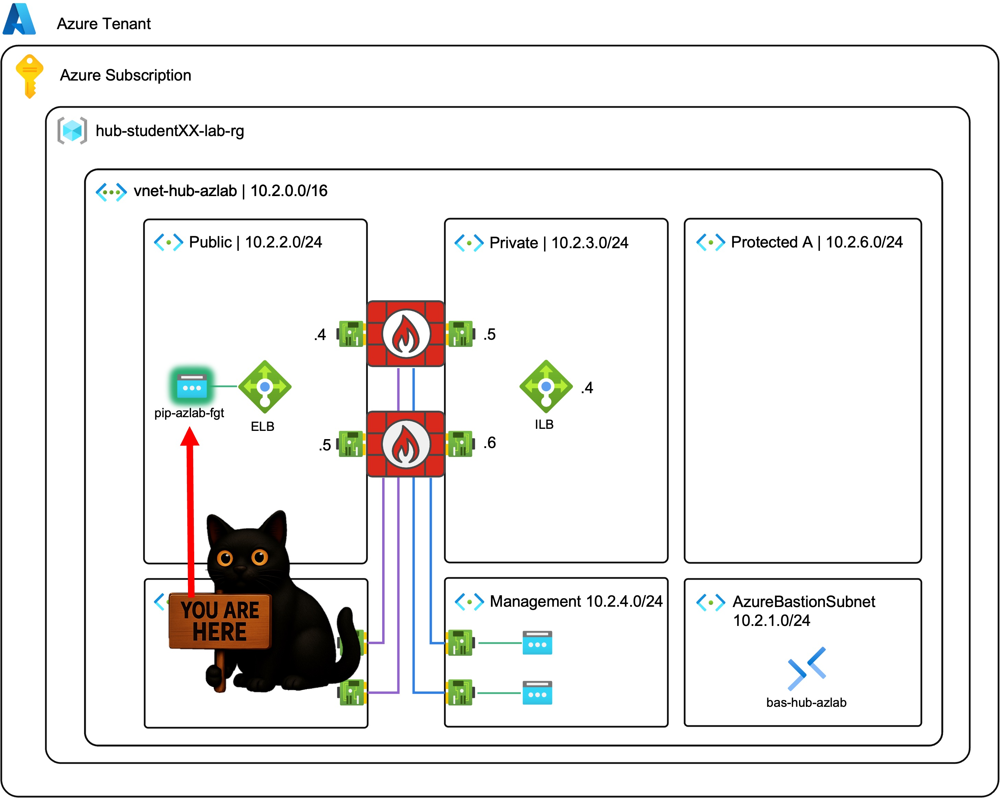

32. Click create new under the External Load Balancer and edit the name to match the screenshot below.

    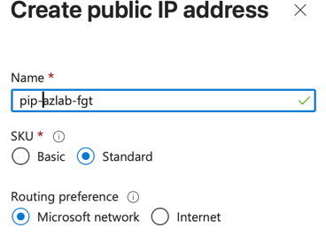

33. Click OK at the bottom of the screen.

     Your Quest Map
    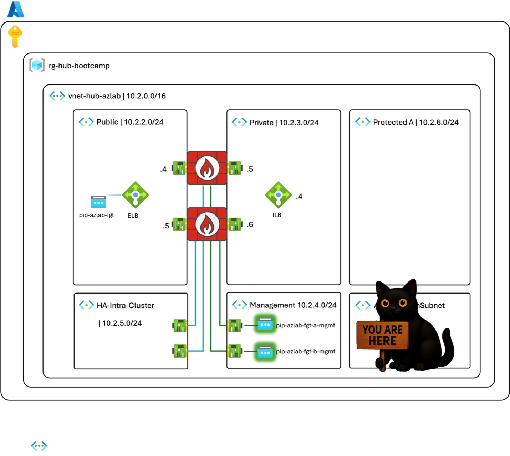

34. Repeat this process for FortiGate A and B management and match the name in the screen shots below.

    **FortiGate A**

    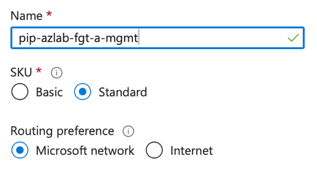

    **FortiGate B** 

    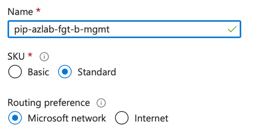

35. When you are finished, ensure your configuration looks like the screenshot below.

    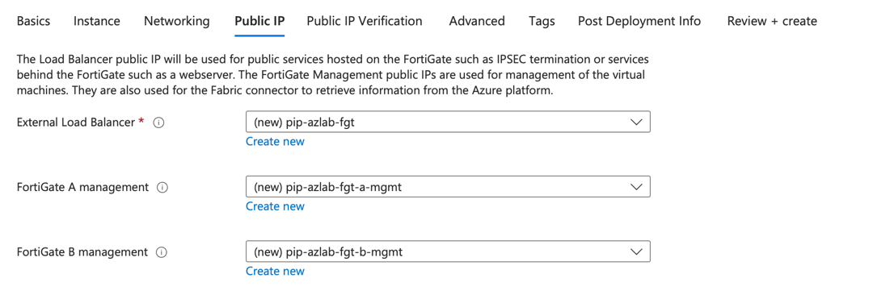

36. Click Next at the bottom of the page until you reach the Review and create page.

37. Allow the final validation to run. This may take up to 30 seconds.

38. Click Create at the bottom of the page.

    ## Deployment Verification

39. Eventually your screen will refresh show something similar to the one below.

     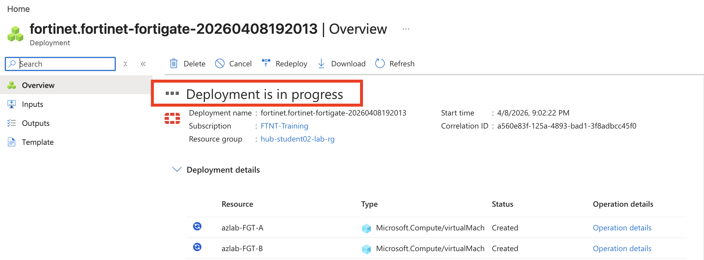

40. When your deployment is complete it will look similar to the screen shot below. This can take a few minutes to display.

     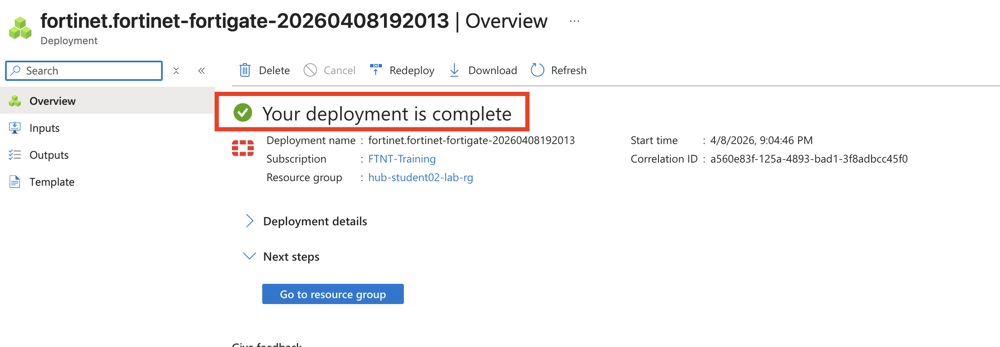

## FortiGate HA Function Verification 
Let's login to each FortiGate to ensure it is functional. 

1.	Navigate to your hub-studentXX-lab-rg. Use the search bar at the top of the screen to search for it if needed.
2.	In the list of resources click on azlab-FGT-nic4, this is the management interface.
3.	Make a note of the IP address on the right-hand column. 
4.	Open another browser tab and enter https://Your FortiGateA IP address, 
5.	Login with username fortinetuser.
6.	Password is PizzaDay12345!
7.	Skip the startup wizard.
8.	If you are taken to the dashboard, congratulations you FortiGate-A is functional.
9.	Now let’s check on FortiGate B, navigate back to the hub-studentXX-lab-rg.
10.	If necessary, click on page 2 at the bottom of the screen, and find azlab-FGT-B-nic4 and click on it.
11.	Note the Public IP address and copy it.
12.	In a new browser, open a tab to https://yourFortigateIPB Address
13.	Login with Username fortinetuser
14.	Password is PizzaDay12345!
15.	If you see a screen that states you need to upload a license, perform the steps below, if you are taken to the dashboard after the wizard, your unit is functional, and you can skip ahead to Task 3 Deploy Applications and Configure the Network.

 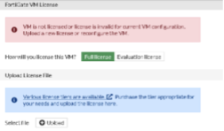

## Fixing licensing issue on the FortiGate

**Please only complete this section if you had a licensing issue on the FortiGates.**

1.	Navigate back to your open Azure tab and find your rg-hub-azlab resource group.
2.	In the resource section find azlab-FTG-A and click on it. 
3.	Click on Stop.  
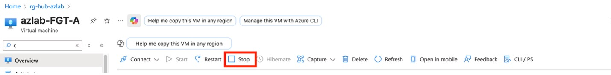
    
4.	Close your browser tab that was connected to FortiGate B.
5.	Wait a couple minutes. 
6. Re-login to FortiGate B and see if you now get the regular wizard or dashboard.
7. Once your FortiGate B is registered, navigate back to the tab where you have Azure Open on FortiGate A. 
8.	Click on the Start button.
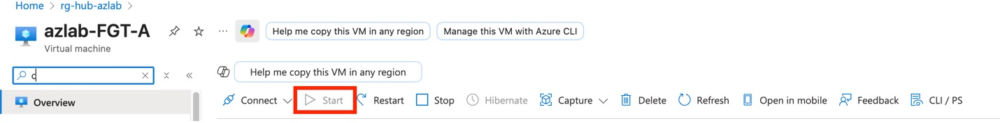
9.	Wait until it fully boots. 
10.	Now both of your FortiGates are functional.

!!!Note "Why does this happen?"
    The external load balancer will always send traffic to FortiGate A as it is the primary, therefore FortiGate B can have difficulty registering with FortiGuard. By Stopping FortiGate A, we allowed FortiGate B to take over as primary and register itself.

---

**Next Step:** [Deploy Applications and Configure the Network](03Task3: Routing.md) to validate your deployment and test connectivity flows.
