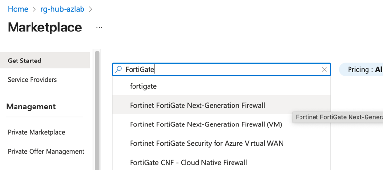
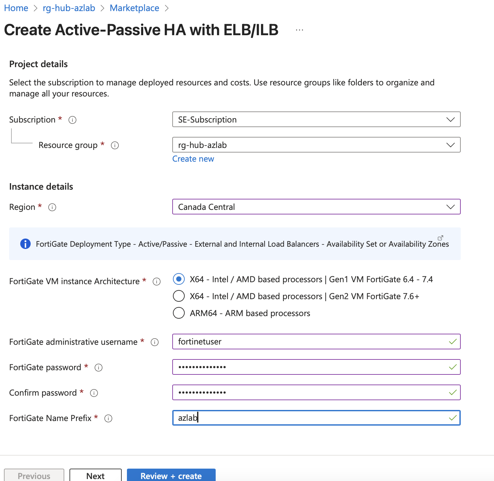
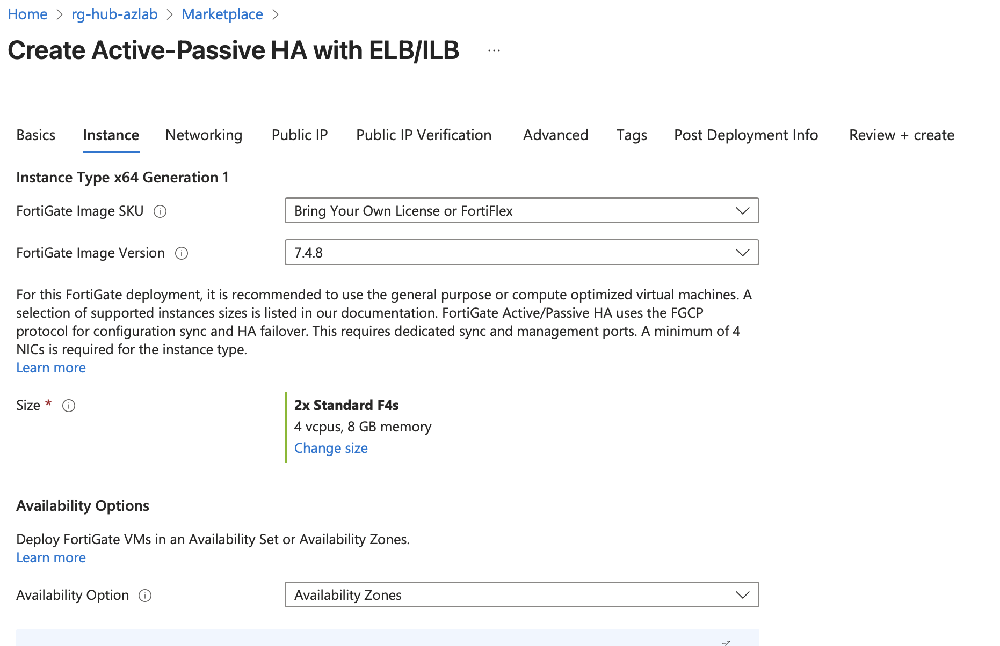
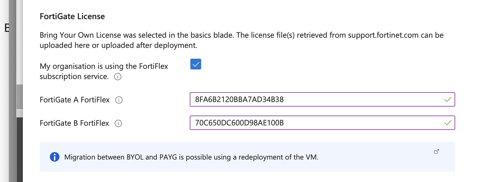
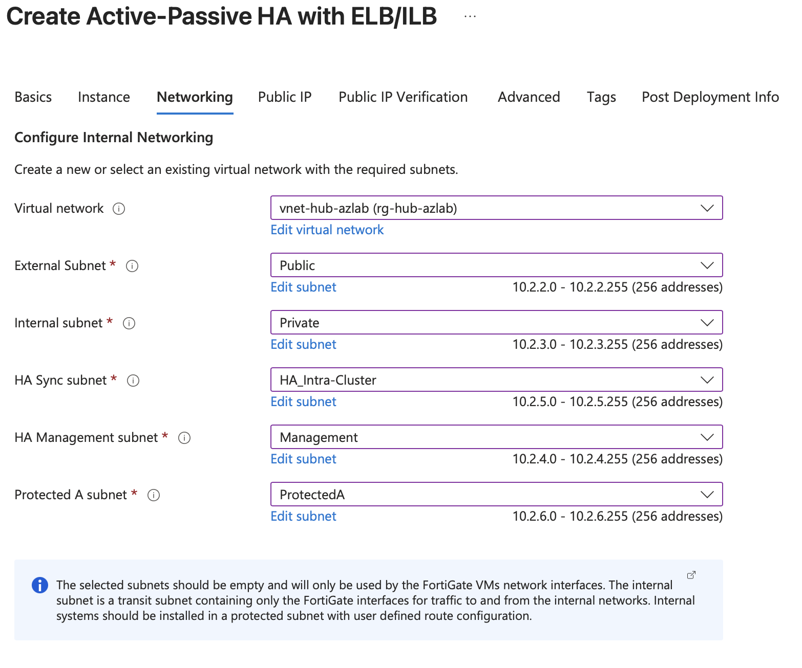
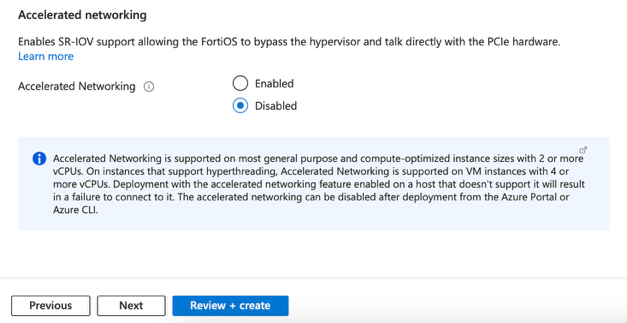
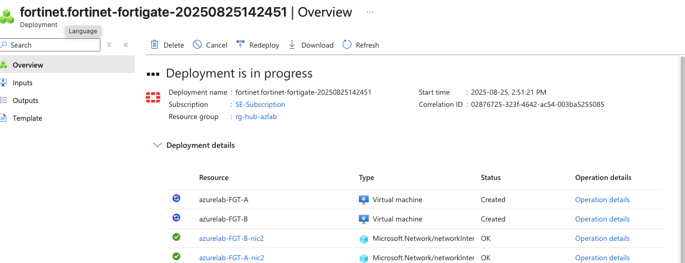
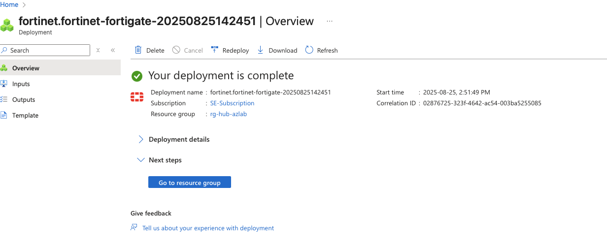

# Task 2: FortiGate Deployment

In this section, we'll deploy FortiGate firewalls in a high-availability configuration with load balancers to provide robust security for your connectivity hub. You may have heard of the name Load Balancer (LB) sandwich - we are deploying the firewalls between two LB instances to ensure symetric flows of traffic between services behind and infront of the firewalls.

## On this page
- [High Availability Overview](#high-availability-overview)
- [Template Deployment](#template-deployment)
- [Configuration Parameters](#configuration-parameters)
- [Licensing Configuration](#licensing-configuration)
- [Load Balancer Setup](#load-balancer-setup)
- [Deployment Verification](#deployment-verification)

## High Availability Overview

We are now ready to deploy the HA FortiGate-VMs from Azure Marketplace. We are going to deploy two FortiGate-VMs running in Active-Passive mode. We will also deploy two load balancers to load balance traffic from both internal and external sources! Does that sound like too much? Don't worry, Azure MarketPlace has a preconfigured template to take care of all that! Ready? Let’s go!

For additional information regarding the various templates available and their respective SLAs for failover please see [FortiGate Azure Addministration Guide.](https://docs.fortinet.com/document/fortigate-public-cloud/7.4.0/azure-administration-guide/983245)

## Template Deployment

1. In the top left corner of the screen click on rg-hub-azlab in the breadcrumb trail.

    

2. Click on Create.

    

3. Enter FortiGate in the search box then click on Fortinet FortiGate Next-Generation Firewall.

    

4. Click on the dropdown for Create for Fortinet FortiGate Next-Generation Firewall (not the option that ends with VM)

5. Click on Active-Passive HA with ELB/ILB in the drop-down menu.

    

    !!! note annotate "Note"
        ELB and ILB stands for external load balancer and ILB stands for internal load balancer. 

    ## Configuration Parameters

6. Select rg-hub-azlab in the Resource group drop down.

7. Set region to Central Canada.

8. Set the FortiGate administrative username to `fortinetuser`

9. Set the password to `PizzaDay12345!`

10. Type the same password in the Confirm password box: `PizzaDay12345!`

11. Set the FortiGate Name Prefix to azlab

12. Click Next.

     
    
13. Ensure FortiGate Image SKU is set to Bring Your Own License or Fortiflex then ensure FortiGate Image Version is set to 7.4.8.

14. Ensure Availability Option is set to Availability Zones.

     

    What are availability zones?

    

    Wouldn’t it be nice if we all had a spare home? If something were to happen to one of them, we just move over to the other one? This analogy loosely explains availability zones as they help create redundancy and high availability. How? According to learn.microsoft.com Availability Zones are separated groups of datacenters within a region. Each availability zone has independent power, cooling, and networking infrastructure, so that if one zone experiences an outage, then regional services, capacity, and high availability are supported by the remaining zones. 

    Look at the diagram below, see how there is Availability Zone 1 and 2 in dashed blue boxes? Those FortiGates are deployed in two different data centers! If one data center goes down, we can fail over to the other! 

    

    Are availability zones the only form of High availability? No, there is also something called an Avaiability Set, you can find more information here: https://learn.microsoft.com/en-us/azure/virtual-machines/availability-set-overview.
    
    ## Licensing Configuration

15. Scroll down.

16. Check the 'My organization is using the FortiFlex subscription service' box.

17. You were provided FortFlex tokens, you will use those tokens to license these firewalls. **Do not copy the tokens in the screenshot below**.

18. Enter one of the provided tokens for FortiGate A.

19. Enter one of the provided tokens for FortiGate B.

     

20. Click Next.

21. We will now map the subnets we created earlier to the FortiGate.

22. Click on the dropdown menu beside Virtual network and select vnet-hub-azlab.

23. Click on the dropdown menu beside External subnet and select Public.

24. Click on the dropdown menu beside Internal subnet and select Private

25. Click on the HA Sync subnet dropdown and select HA_Intra-Cluster.

26. Click on the HA Management subnet dropdown and select Management.

27. Notice we are also creating a new subnet called Protected A subnet; leave it a the default setting.

28. If needed, scroll down the Accelerated networking and select disabled.

    !!! Note "Azure Accelerated Networking"
        Azure Accelerated Networking uses hardware-based virtualization to directly link a VM's network interface (NIC) to its network, bypassing the host's virtual switch and improving performance. We don’t need this in our lab. In a production enviroment you can turn on accellerated network to tell Azure to deploy the SR-IOV NIC driver rather than the standard driver, giving better performance.

29. Confirm your configuration looks like the screenshot below.

     
    
     

    ## Load Balancer Setup

30. Now we will create public IP addresses for the external load balancer and FortiGate management interfaces.

    Your Quest Map
    
    

31. Click create new under the External Load Balancer and edit the name to match the screenshot below.

    

32. Click OK at the bottom of the screen.

     Your Quest Map
    

33. Repeat this process for FortiGate A and B management and match the name in the screen shots below.

    **FortiGate A**

    

    **FortiGate B** 

    

34. When you are finished, ensure your configuration looks like the screenshot below.

    

35. Click Next at the bottom of the page until you reach the Review and create page.

36. Allow the final validation to run. This may take up to 30 seconds.

37. Click Create at the bottom of the page.

    ## Deployment Verification

38. Eventually your screen will refresh show something similar to the one below.

     

39. When your deployment is complete it will look similar to the screen shot below. This can take a few minutes to display.

     

## FortiGate HA Function Verification 
Let's login to each FortiGate to ensure it is functional. 

1.	Navigate to your rg-azlab-hub. Use the search bar at the top of the screen to search for it if needed.
2.	In the list of resources click on azlab-FGT-nic4, this is the management interface.
3.	Make a note of the IP address on the right-hand column. 
4.	Open another browser tab and enter https://Your FortiGateA IP address, 
5.	Login with username fortinetuser.
6.	Password is PizzaDay12345!
7.	Skip the startup wizard. 
8.	If you are taken to the dashboard, congratulations you FortiGate-A is functional.
9.	Now let’s check on FortiGate B, navigate back to the rg-hub-azlab.
10.	If necessary, click on page 2 at the bottom of the screen, and find azlab-FGT-B-nic4 and click on it.
11.	Note the IP address and copy it.
12.	In a new browser, open a tab to https://yourFortigateIPB Address
13.	Login with Username fortinetuser
14.	Password is PizzaDay12345!
15.	If you see a screen that states you need to upload a license, perform the steps below, if you are taken to the dashboard after the wizard, your unit is functional, and you can skip ahead to Task 3 Deploy Applications and Configure the Network.

 

## Fixing licensing issue on the FortiGate

**Please only complete this section if you had a licensing issue on the FortiGate.**

1.	Navigate back to your open Azure tab and find your rg-hub-azlab resource group.
2.	In the resource section find azlab-FTG-A and click on it. 
3.	Click on Stop.  

    
4.	Close your browser tab that was connected to FortiGate B.
5.	Wait a couple minutes. 
6. Re-login to FortiGate B and see if you now get the regular wizard or dashboard.
7. Once your FortiGate B is registered, navigate back to the tab where you have Azure Open on FortiGate A. 
8.	Click on the Start button.

9.	Wait until it fully boots. 
10.	Now both of your FortiGates are functional.

!!!Note "Why does this happen?"
    The external load balancer will always send traffic to FortiGate A as it is the primary, therefore FortiGate B can have difficulty registering with FortiGuard. By Stopping FortiGate A, we allowed FortiGate B to take over as primary and register itself.

---

**Next Step:** [Deploy Applications and Configure the Network](03Task3: Routing.md) to validate your deployment and test connectivity flows.
