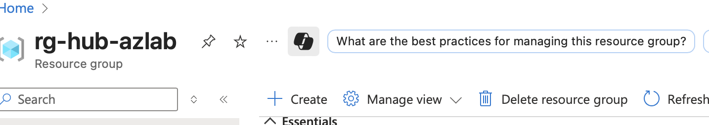
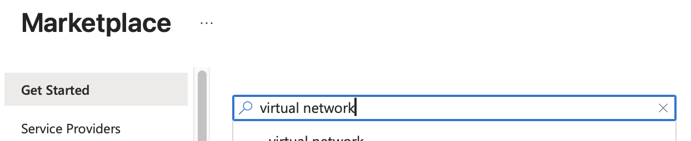
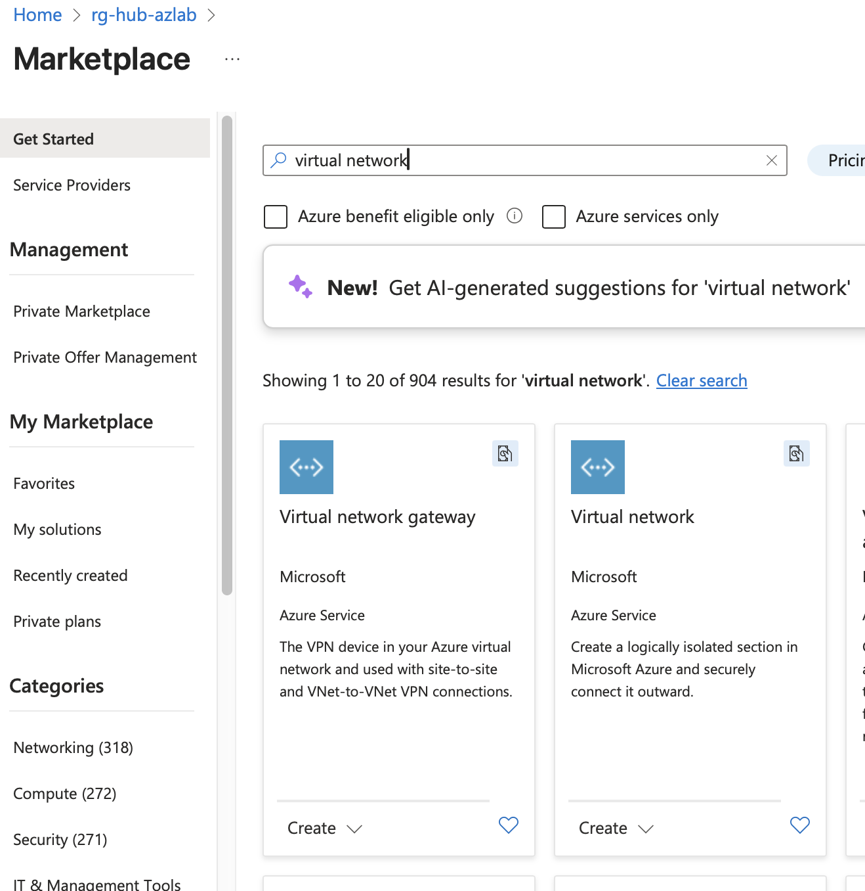
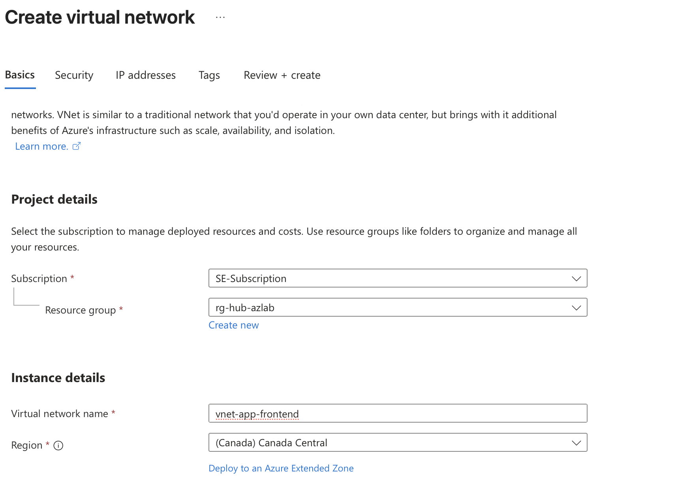
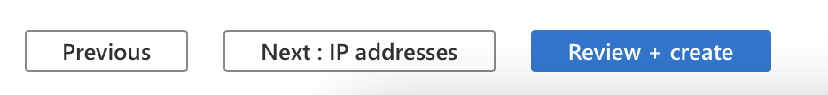
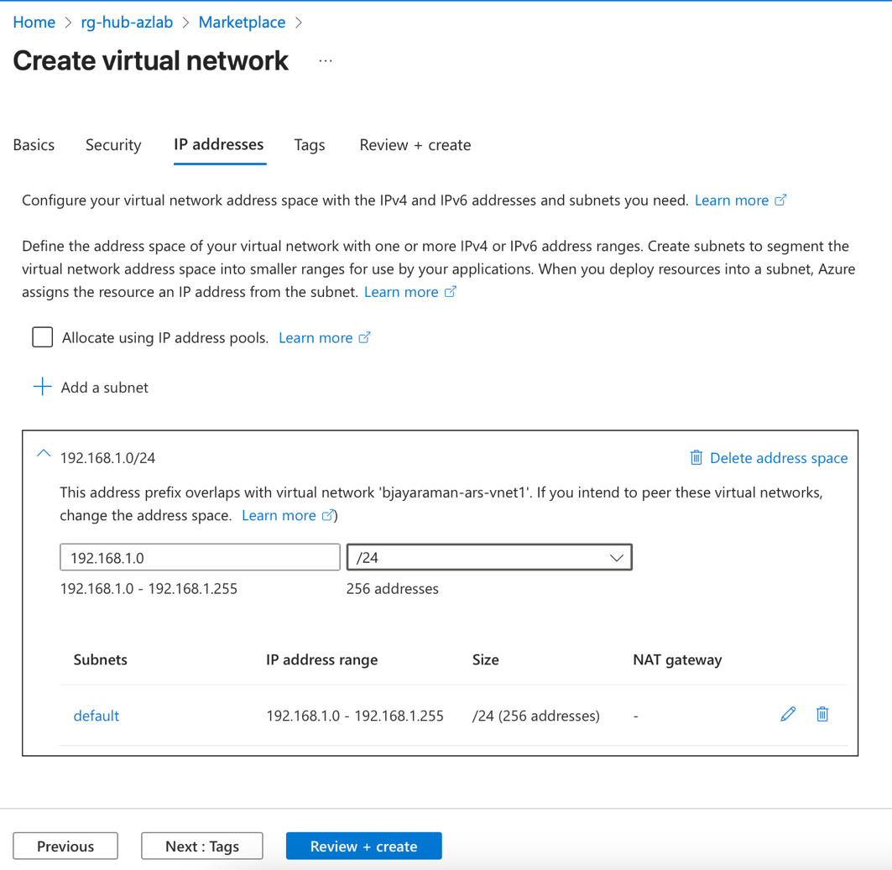
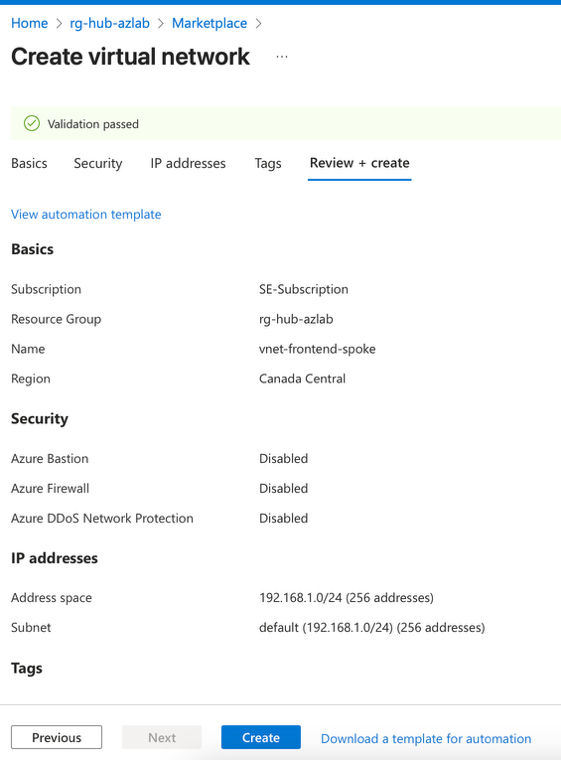
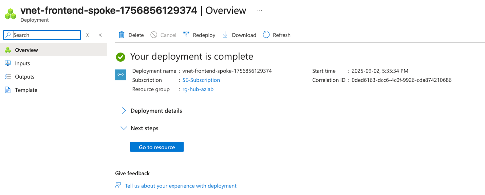
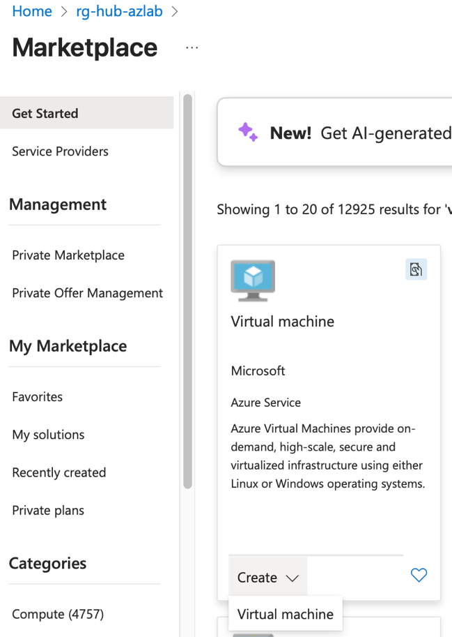
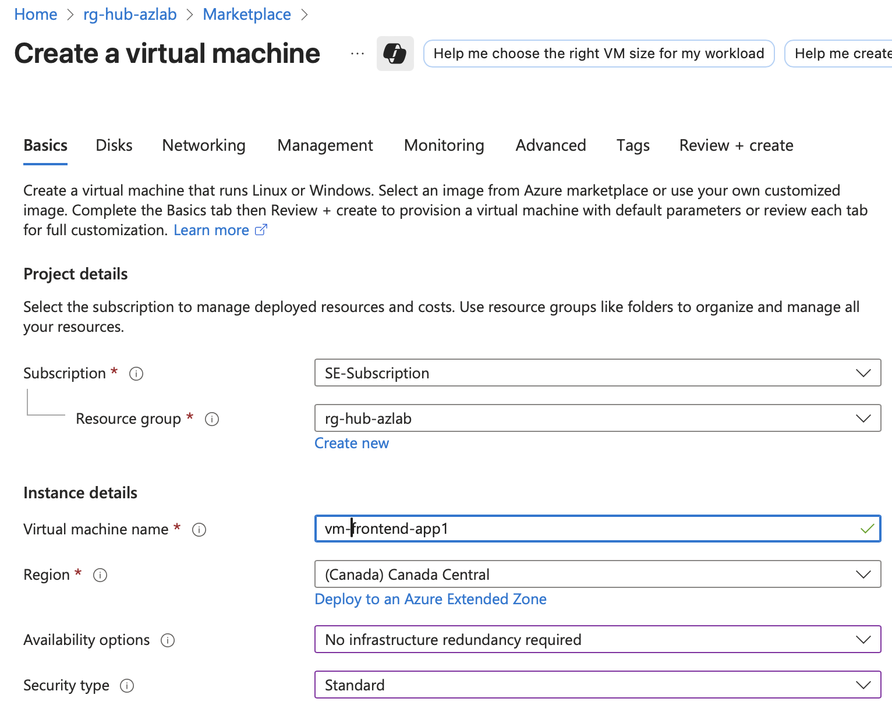

# Task 3: Deploy Applications and Configure the Network

In this section, we'll deploy spoke networks and test virtual machines to validate your connectivity hub architecture and ensure all components work together properly.

## On this page
- [Architecture Overview](#architecture-overview)
- [Spoke Network Deployment](#spoke-network-deployment)
- [Create Virtual Machine](#create-a-virtual-machine)
- [Configure Inter-VNet Routing](#configure-inter-vnet-routing-)

## Architecture Overview

There are two common methods for deploying applications:

-   :material-hub-outline: **Hub and Spoke Topology**

    ---

    Using Hub and Spoke topology with VNet (Virtual Network) peering for scalable architectures.

    **Best for:**
    
    - The separation of Production and Development environments.
    - Shared services deployment (security, NTP, DNS, Active Directory).
    - Controlling communications between workloads.
    - Separate VNets for each workload

-   :material-shield-outline: **Protected Subnet**

    ---

    Using the Protected subnet within the Connectivity Hub VNet for simplified deployments.

    **Best for:**
    
    - Simpler network architectures.
    - Applications requiring direct hub connectivity.
    - Single-tenant scenarios. 
    - Sending traffic between VNets costs money. You can save money by placing it in the Protected Subnet. 
    - For example, we could deploy FortiManager and FortiAnalyzer in a protected subnet. 

## Spoke Network Deployment

Your Quest Map

We are now going to create our spokes to deploy our "applications" into. We are going to utilize our existing resource group to do so. However, in a production environment you can choose to create separate resource groups for spokes if that fits your business model better.

The purpose of this lab is to simulate basic connectivity, so we are not going to deploy a real functioning application. Let's pretend we have an app that requires a public facing front end, and a back end that only the "webserver" front end will talk to.

1. Navigate to your rg-hub-azlab resource group. You can search for it by name in the search bar at top of the screen if needed.

2. Click on Create.

    

3. In the 'Search the Marketplace' textbox, type virtual network and press enter on the keyboard.

    

4. Click on Create under the virtual network option.

    

5. Click on Virtual Network from the dropdown.

6. Ensure the resource group is rg-hub-azlab.

7. Set the name as `vnet-app-frontend`.

8. Ensure the Region is set to Canada Central.

    

9. At the bottom of the screen click Next Security. (Your button may just say Next)

    

10. We are not going to create a bastion this time so click Next: IP addresses.

     

11. Change the subnet to 192.168.1.0 and select /24 from the dropdown menu.

12. Click Review and create at the bottom of the screen.

    

13. Allow the validation to process.

14. Click create at the bottom of the screen.

    

15. Your screen should look similar to the screenshot below when completed. 

    

    ## Create a Virtual Machine

    Your Quest Map

    

16. We are now going to create the virtual machine to represent our 'app' in this spoke.

17. Search for rg-hub-azlab in the search box at the top of the screen.

18. Once you open the resource group click Create.

     

19. In the 'Search the Marketplace' textbox, type virtual machine and press enter

20. Under the virtual Machine click the Create button.

21. Select Virtual machine from the dropdown.

     

22. Ensure your resource group is set to rg-hub-azlab.

23. Set the Virtual machine name to `vm-frontend-app1`.

24. Set Region to Canada Central.

25. Under availability options select No infrastructure redundancy required.

    a.  We are doing this in the lab for simplicity reasons. You may choose differently for a real production application.

26. Select security type to Standard.

     

27. Click on the arrow beside the image text box and search for Ubuntu Server 24.04 and select 'Ubuntu Server 24.04 LTS -- x64 Gen2'.

28. Scroll down until you see the Size option and click the dropdown.

29. Select Standard_D2s_v3 -- 2 vcpus, 8GiB memory.

     

30. Scroll down to the Administrator account section.

31. Change the Authentication type to Password.

32. Set the username as `azureuser`

33. Set the password as `HappyChicken123!`

34. Type the same password in Confirm password `HappyChicken123!`

    

35. !!! warning "Important"
        Set Public inbound ports to None

    

36. Click Next: Disks\> as shown in the screenshot above.

37. Leave everything at its default on the Disks screen and click Next : Networking.

     

38. Click the dropdown for Virtual Network and scroll until you find vnet-frontend-spoke and select it.

39. Ensure the subnet is default (192.168.1.0/24).

40. Set the Public IP to none.

41. Click delete NIC when VM is deleted. 

    

42. Click Create at the bottom of the screen once the validation passes.

43. Wait for your virtual machine to be deployed, this will take a couple minutes.

    

44. Challenge yourself! Repeat this section to create a VNet and VM for the backend app. Use the table below as a reference for what to enter.

    | Setting Name              | Value              |
    |---------------------------|--------------------|
    | Virtual Network Name      | vnet-backend-spoke |
    | Network and Subnet        | 192.168.2.0/24     |
    | Virtual Machine Name      | vm-backend-app1    |
    | Administrator Username    | azureuser          | 
    | Password/Confirm Password | HappyChicken123!   |
    | Subnet                    | 192.168.2.0        |
    | Public IP                 | None               |

## Configure Inter-VNet Routing 

So, what have we just built? If we use the analogy of a neighbourhood, we essentially have built two homes where people can talk to others in their homes, but  can’t leave to talk to the neighbours! In other words, hosts within a VNet can talk to other hosts in the same VNet by default, but they can’t talk to hosts outside of the VNet. There are two tools to help us facilitate inter-VNet communication VNet peering and User Defined Routes (UDR). 

If your background is in networking, you may find this a little confusing at first. So, let’s break it down. First, we are going to build a ‘road’ between each of our spokes and the connectivity hub by creating a VNet peering. Next, we will build a signpost to direct traffic how to use the road, the signpost is the User Defined Route (UDR). Let’s start by connecting the frontend spoke to the hub. 

Your Quest Map

1. Navigate to your resource group az-hub-azlab. Use the search bar at the very top of your screen to search for it if you need to.
2. In the Resources menu, scroll down until you can see the vnet-hub-azlab. It may be at the very bottom and click on it. 

    

3. Under the settings menu on the left-hand side, click on Peerings then Add. 

    

4.  Enter frontend-spoke-to-hub in the Peering link name.
5.	Click the dropdown arrow and start typing vnet-frontend-spoke and select it from the search results.
6. Ensure the two checkboxes are highlighted as shown in the screenshot below. This section sets the peering settings for the other vnet (our frontend spoke in this case).

    

7. Scroll down to Local virtual network summary. Here we are setting the peering settings for the hub vnet. 
8. Name the peering link name hub-frontend-spoke. 
9. Ensure the first checkbox is clicked 
10. Click Add. 
    
11. Note it may take a couple minutes for the peering to display fully synced. 
    
12.	Repeat this process to create the backend VNet. Your config should look like the two screenshots below.
    
    
## UDR Creation
Ok we’ve built our ‘roads’ but we need to build the UDR (signpost), so Azure knows how to forward traffic. Let’s build our first UDR.

Routing in Azure differs from traditional datacenter environments because it’s based on **system-managed routing tables** rather than fully manual configurations. In an on-premises setup, firewalls and routers typically control all subnet-to-subnet routing directly, and VPNs often require explicit routes (static or dynamically advertised). In Azure, however, each virtual network (VNet) automatically creates routes between its subnets, meaning traffic **could** bypass a firewall unless you specifically configure User-Defined Routes (**UDR**s) to force it through. Similarly, when using VPN gateways, Azure handles the propagation of routes into the VNet, but you’ll often need to fine-tune UDRs to ensure traffic flows through security appliances like FortiGate rather than taking the default system path. This shift from hardware-centric to platform-managed routing is a key difference to keep in mind when designing secure architectures.

1.	Navigate back to the rg-hub-azlab. 
2.	Click Create.
    
3.  In the Search the Marketplace text box type Route Table and hit enter on the keyboard.
4.	In the Route table box, click on create then select Route table.
    
5.  Ensure the Resource group is set to rg-hub-azlab.
6.	Set the Region to Canada Central.
7.	Set the Name to udr-frontend-spoke
8.	Click Review and Create.
9.	Click Create.
    
10. Wait until the deployment is complete and looks similar to the screenshot below. 
    
11. Now that we have created a routing table, we need to get the IP address of the Internal load balancer located in the hub. We are going to use it as our destination for all outbound traffic.
12. Open a new browser tab and login to Azure and go to the rg-hub-azlab route group.
13. Scroll down in the Resources area until you see azlab-internalloadblancer and click on it. 
    
14. You may be wondering where the IP address is, look for the show more button as shown in the screen shot below.
    
15. Hover your mouse over the IP address and click copy to clipboard. (Note your public IP address will not be the same as the screenshot below)
    
16.	Go back to the browser tab with the open route table you just created.
17.	Click on Settings on the left-hand side and then click on Subnets.
    

18. Click on Associate.
    
19. In the menu that pops out of the left-hand side of the screen, search for your vnet-frontend-spoke and ensure the subnet says default.
    
20.	Click Ok at the bottom of the pop out menu.
21.	Now we are going to add a route. 
22.	On the left-hand side menu click on Route.
23.	Then click on add.
  
24.	Set route name as to_hub.
25.	Set Destination type to IP Addresses
26.	Set Destination IP addresses to 0.0.0.0/0.
27.	Set next hop type to Virtual appliance
28.	Paste the IP address of your internal load balancer. (do not copy the address in the screenshot below)
    

Challenge Time: Now that you have created the Route table and UDR for connectivity to the frontend spoke, challenge yourself to repeat the process for the backend spoke. There are settings below if you need a reference. 

Create the Route table

- Resource group: rg-hub-azlab
- Region: Canada Central
- Name: udr-backend-spoke
- Propagate gateway routes? No

Route Table

* Associate: vnet-backend-spoke
* Routes
* Name: to_hub
* Destination type: IP address
* Destination IP address 0.0.0.0/0
* Next hop type: Virtual Appliance
* Next hop address IP of your internal load balancer

---

**Next Step:** [Create Firewall Rules](04-Task 4:-Create-firewall-rules.md) Enabling traffic to flow.