# Task 4: Modify Firewall Rules to Permit North-South Traffic

Now that we have peered our VNets and built our routing tables everything is ready, right? Not quite! Remember, we pointed the UDR towards the load balancer, which then passes traffic to the FortiGate for inspection. We need to set a policy in the firewall to permit traffic. Let’s start with North-South traffic like traffic destined to the Internet.

1.	First, let’s refresh our memories of which port each is connected to the Public and Private subnets. This will help us to write our firewall rules.
2.	Use the picture below to help you map your interfaces.
    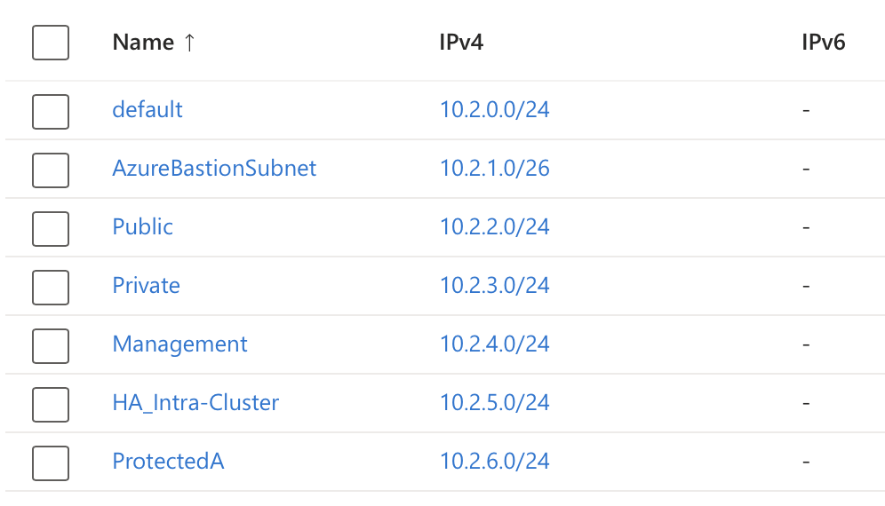
3.  Navigate to your rg-azlab-hub resource group. Use the search bar at the top if needed. 
4.	Click on azlab-FGT-A.
5.	Scroll down until you see the public IP address on the right-hand side. Note your IP address will be different from the one below.
    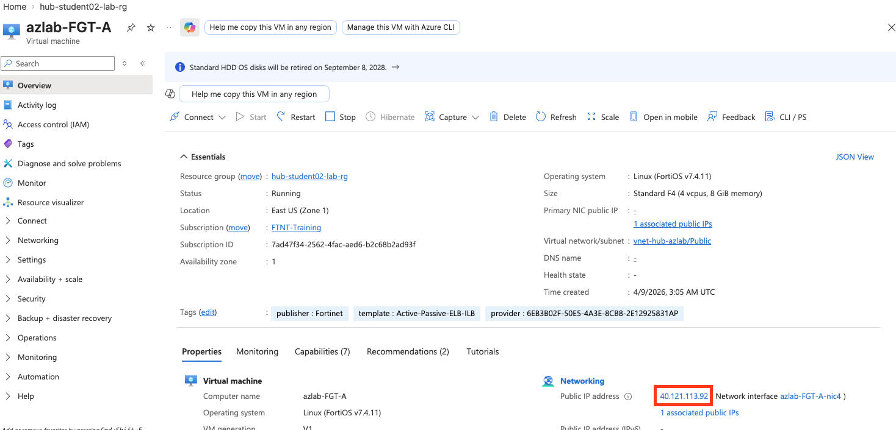
6.  Copy the address, go to a new tab in your browser and enter https:// then paste the IP address of FortiGate-A. Hit enter on the keyboard.
7.	Login in with username: fortinetuser Password PizzaDay12345!
8.	On the left-hand side, navigate to Network and then Click on Interfaces. 
    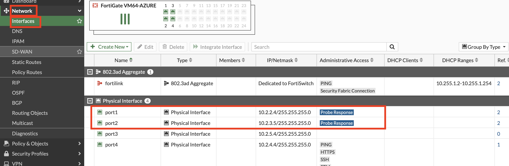
# Question 1: using the diagram at the start of this task, which interface is connected to the public subnet?

- [ ] Port 1
- [X] Port 2
- [ ] Port 3
- [ ] Port 4 

# Question 2: Which port is connected to the internal or private subnet?
- [X] Port 1
- [ ] Port 2
- [ ] Port 3
- [ ] Port 4 

Now that we know our interface mappings, let’s create our policy.

1. Navigate to Policy & Objects > Firewall Policy.
2. Click Create new.
    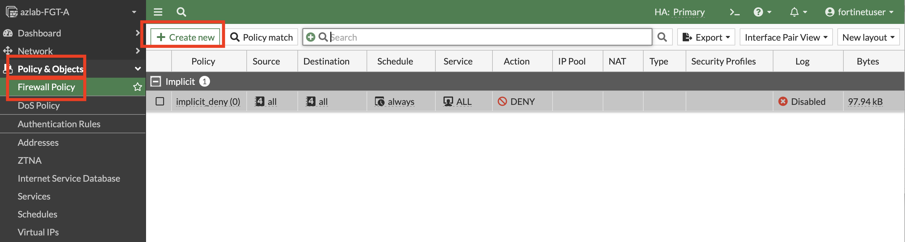
3. Make your policy match the settings in the screenshot below.
    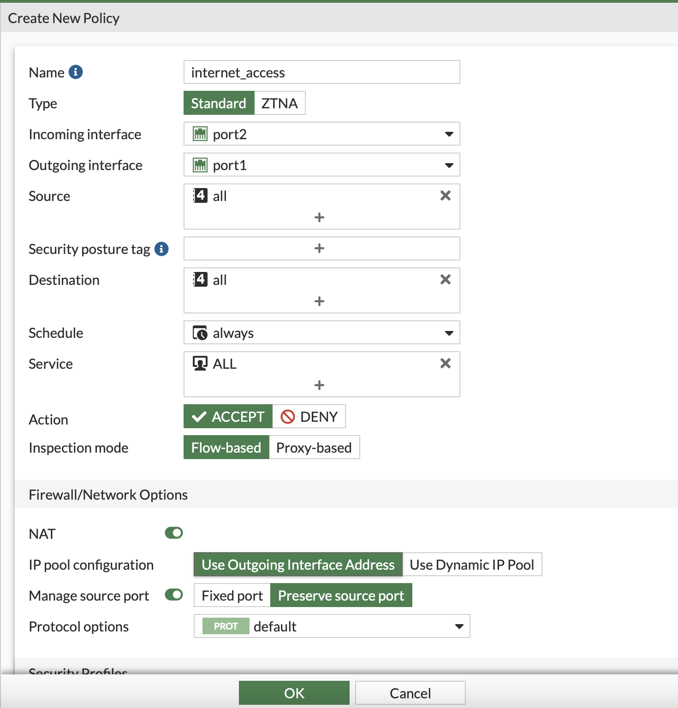
4. Click OK.

    Does this mean we are done?!

    

    Remember, the FortiGates don’t know where to send traffic, so we need to provide static routes. First, let’s follow best practice and create some address objects for our two spokes. 

5. In the left-hand menu, click on Policy & Objects then Addresses.
6. Click the Create New button.
    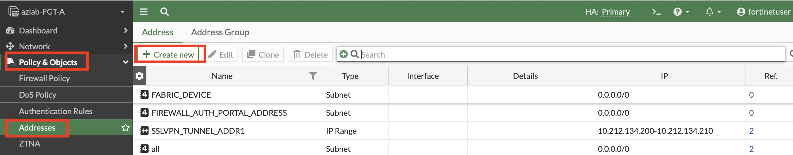
7. Enter the configuration as shown below.

    !!! Note
        Ensure you toggle on the Static Route Configuration button.

    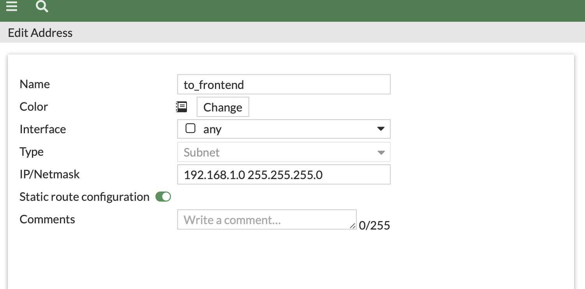

8. Click OK.
9. Repeat this process for the Backend subnet.
    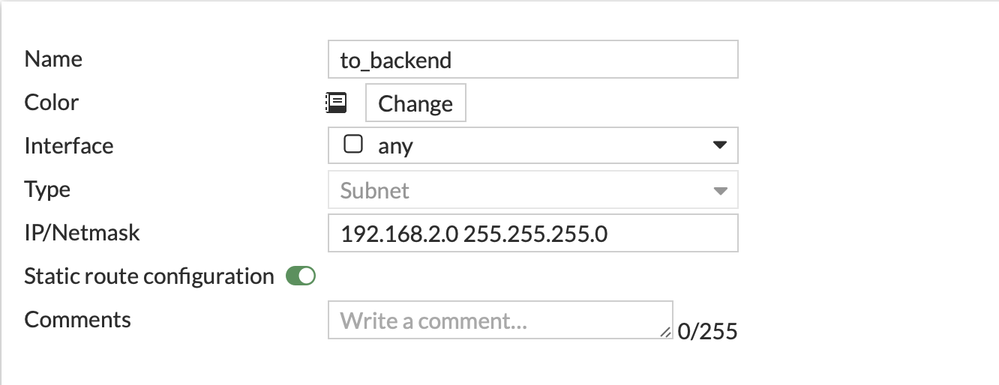
   We are now going to create two static routes. One to the frontend VNet and the other to the backend VNet. We are now going to create two static routes. One to the frontend VNet and the other to the backend VNet.

10. We need to use the IP address of the internal load balancer as our next hop.
11. Go back to your tab with the Azure Portal.
12. Navigate to rg-hub-azlab.
13. Click on azlab-interlaloadbalancer.
14. Find the private IP address of the load balancer, note it will be different than the one in the screenshot below. 
    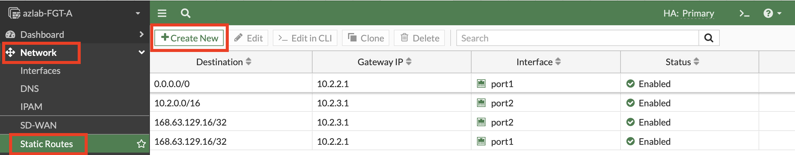
15. Return to your FortiGate A browser tab. 
16. On the left-hand menu, click on Network then Static Routes.
17. Click Create new.
    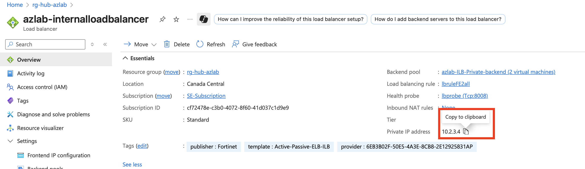
18. Ensure your configuration looks like the screenshot below.
    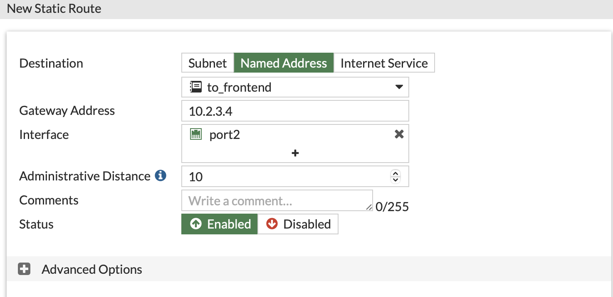
19. Click OK 
20. Repeat this process to create a static route for the backend.
    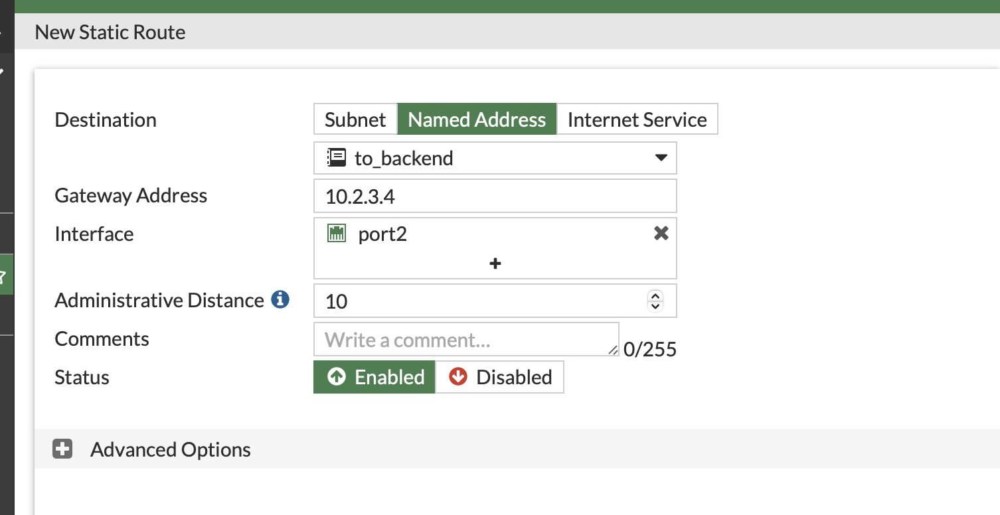

## Testing North-South Traffic
Now for some fun, let’s test our north-south traffic.
Remember back in the beginning we created a bastion? We are going to use that now to access our “apps”.

1. Return to the browser tab with your azure portal.
2.	Navigate to rg-hub-azlab. 
3. Scroll down until you find vm-frontend-app1 and click on it.
    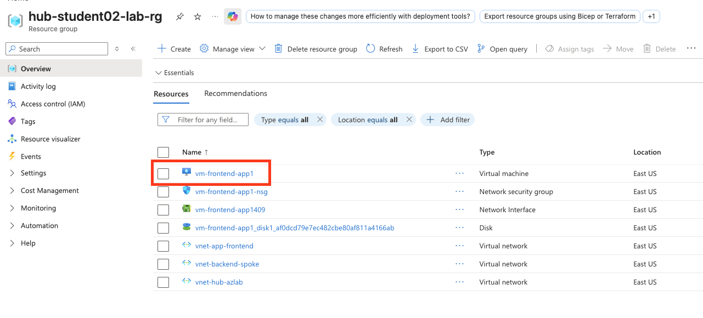
4.  Click on the Connect drop down.
5.	Click Connect via Bastion.
    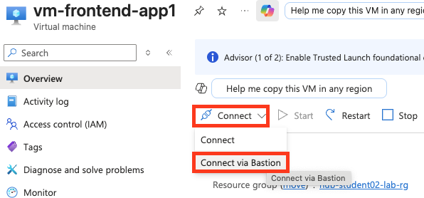
6.  Enter the username of azureuser
7.	Enter the password of HappyChicken123!
8.	Click Connect.
    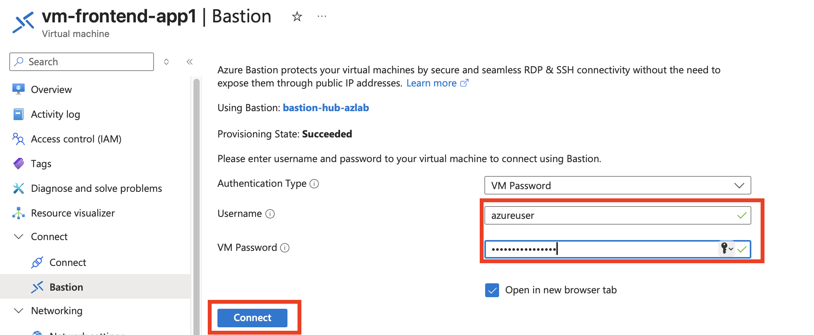

    !!! Note
        Notice the checkmark for open window in new tab, if nothing opens make sure your browser’s pop-up blocker isn’t preventing the window from opening it.

9. Your screen will look similar to the screenshot below.
    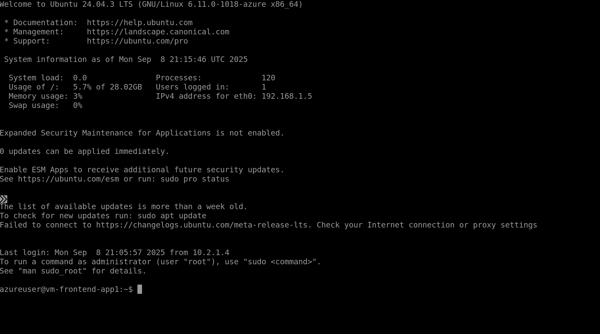
10. Type curl www.google.com and then press enter. This will connect with google.com, do not be surprised if a bunch of text pops up on your screen, that means you were successful in accessing the internet!
    
11. Repeat this testing on the back end virtual machine. 
12. Now let’s test if we can ping our front-end server, on the backend virtual machine type ping 192.168.1.5, which is the IP address of the frontend app. 
13. It will fail!
14. Why? Because we need to permit this traffic in the firewall. 

## Enabling East-West Traffic and Testing

Modify Firewall Rules to permit East-West Traffic

Now we need to permit traffic to go from one spoke to the other, or East-West. We need to create the firewall polices first.

1.	Navigate back to your browser tab that has the admin interface for FortiGate-A open.
2.	Navigate to Policy & Objects then click on Firewall Policy. 
3.	Click Create new.
    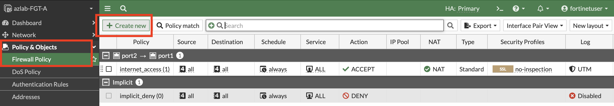
4.  We are going to create the first policy to permit frontend to backend traffic. Make your configuration match the screenshot below.
    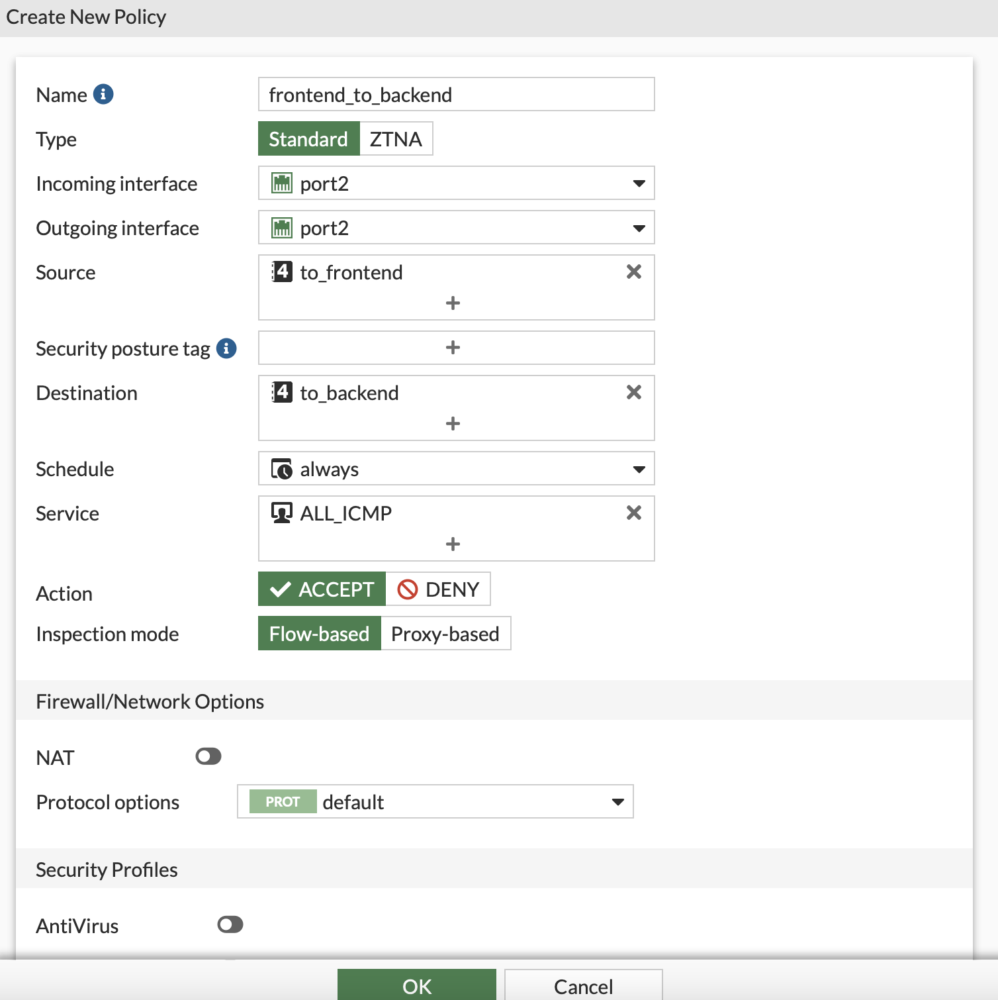
5.  Click OK when done. 
6.  Now let’s create another policy to permit traffic from the backend to the front end. 
7.	Click Create new.
8.	Make your configuration match the screenshot below, then click OK.
    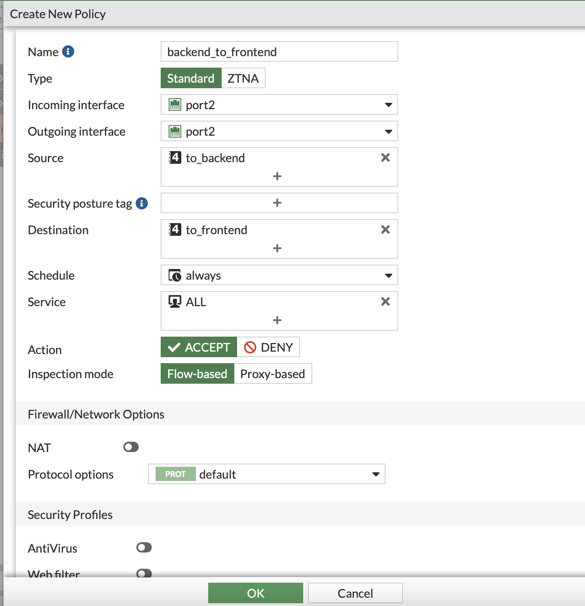

Testing East-West Traffic

1.	If you don’t already have bastion sessions connected to the Frontend and Backend VM’s. Please reopen them in a separate tab. 
2.	On the Backend VM type ping 192.168.1.5. 
3.	The command will now work as the policy permits it. 
4.	Hit Ctrl C to stop the ping.
    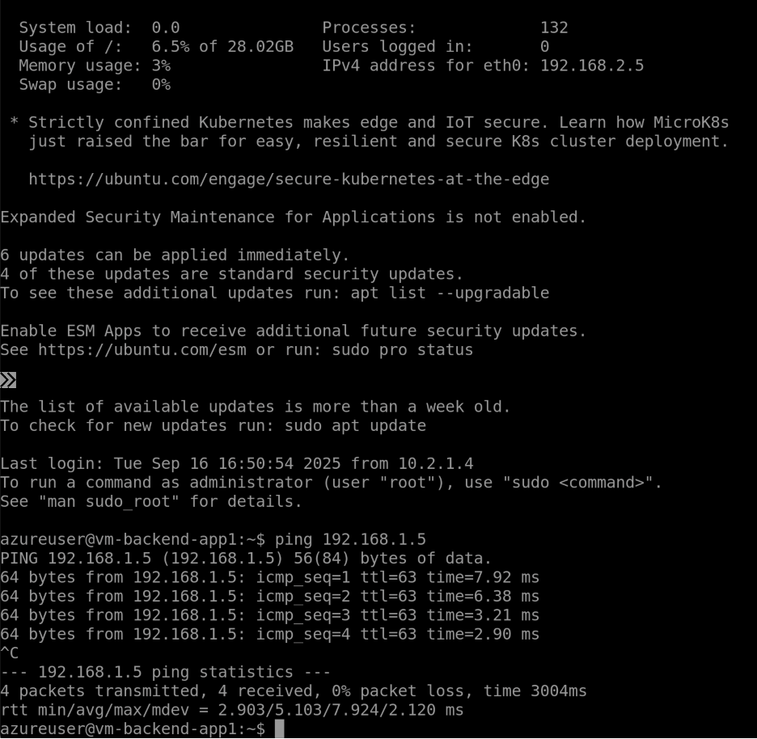
5.  Repeat this process on the Frontend machine, but pint 192.168.2.5, which is the IP of the backend app.
6.	The ping is successful! 
7.	Hit Ctrl C to stop the ping.
8.	Please move to the Clean up task to begin shutting down the VM’s if you don’t shut them down, they will incur charges to your Azure Subscription!

##Clean up!

1.	In the Azure portal, navigate to your rg-hub-azlab resource group.
2.	In the resource section click on the Type column to sort x.
    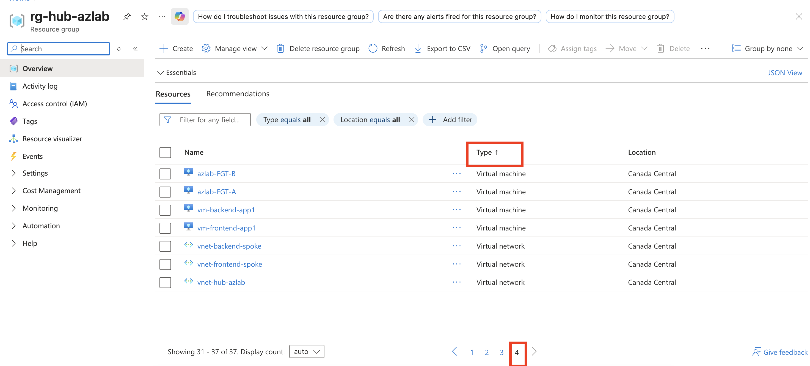
3.  Notice all our virtual machines are now in one section!
4.	Right click on each Virtual machine and open it in a new tab. 
    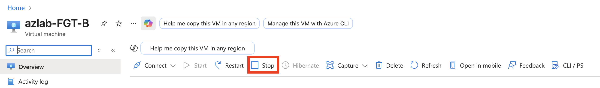
5.  In each tab you just opened click on the Stop button as shown in the screenshot above.
6.	Click Yes to the pop-up asking you to confirm. 
7.	Please ensure all tabs show the device as stopped.
8.	You can tell it’s stopped with the Stop button is greyed out and the Start button is available.
    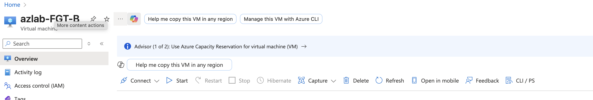
9. If you will not use this lab again it is best to delete all resources, you can do this by going to the resource group opening resources and selecting Delete!. This way you are not charged for the Azure resources you created. 

## You have Completed your Quest!!!
 

---
**Next Step:** [Appendix: Adavanced Operations](05-advanced-operations.md) 
